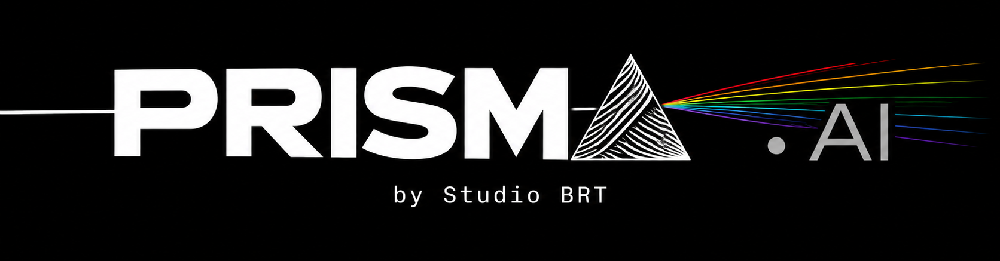
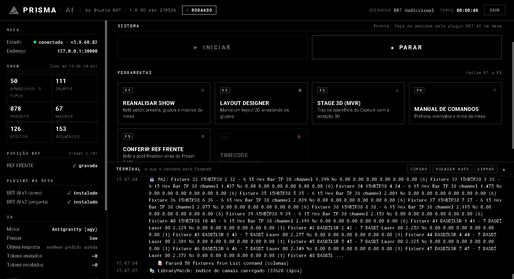
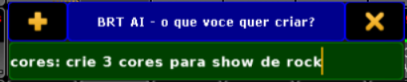
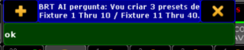
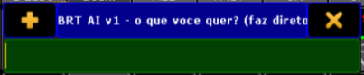
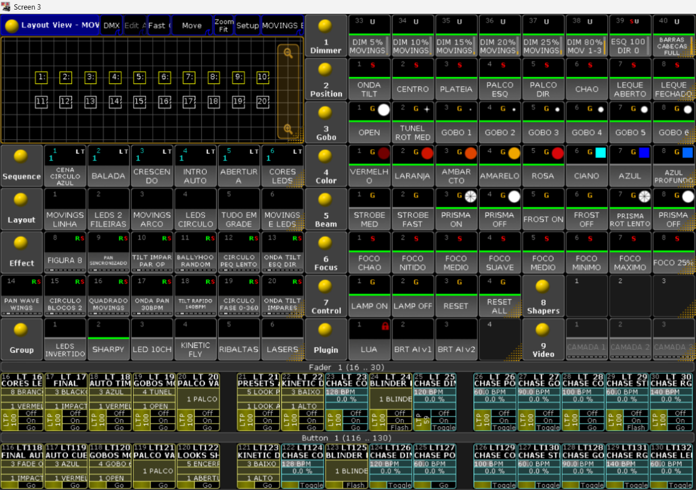
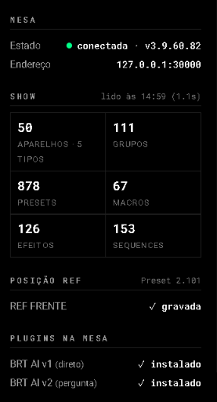
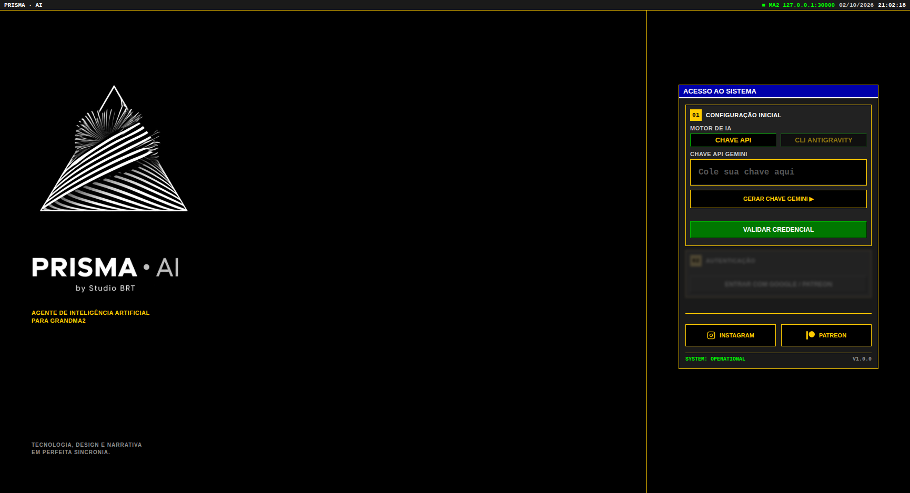

# PRISMA · AI

**Agente de inteligência artificial para grandMA2** · by Studio BRT

### Programe a grandMA2 falando português.

Você escreve o que quer ("crie 3 cores para show de rock", "faça um chase de 4 passos com fade de 2 segundos") e a IA monta e executa os comandos na sua **grandMA2 onPC**. Ela usa os aparelhos, os grupos e os presets do **seu** show, e não grava por cima do que você já fez.

**[⬇️ Baixar a última versão](https://github.com/BRT-STUDIO01/brt-mai-releases/releases/latest)** · Windows 10/11 · grandMA2 onPC 3.9

> 🎁 **Grátis por tempo limitado.** Para liberar o acesso, crie uma conta no **[Patreon do Studio BRT](https://www.patreon.com/c/StudioBRT)** e entre como **membro**, usando o **mesmo e-mail da sua conta Google**. É com essa conta Google que você entra no programa.



---

## Como funciona

**1. Peça na própria mesa.** Os plugins **BRT AI** ficam no pool de Plugins da grandMA2. Você não sai da mesa nem abre outra janela para pedir.


**2. Escreva o que você quer, em português.**



**3. Confira e aprove.** No **BRT AI v2**, a IA mostra o plano antes de mexer no show. Um "ok" e ela executa.



Com pressa? O **BRT AI v1** faz direto, sem perguntar:



**4. Pronto, está na mesa.** Presets, cues e efeitos aparecem nos pools como se você tivesse programado na mão, com nome e no próximo lugar livre.



---

## Por que usar

- **Fala a sua língua:** pedidos em português, do jeito que você fala na passagem de som.
- **Conhece o seu show:** antes de criar, lê o patch, os atributos de cada aparelho, os grupos e o que já existe nos pools. Não inventa canal que o aparelho não tem.
- **Não destrói o seu trabalho:** preset, sequence, executor, macro, efeito, grupo ou layout ocupado? O novo vai para o próximo ID livre.
- **Você no controle:** o **v2** pergunta antes de criar, e o **v1** faz direto. Você escolhe o plugin de acordo com o momento.
- **Posições que fazem sentido:** grave uma posição de referência (**REF FRENTE**) e a IA monta as outras a partir dela, respeitando como os aparelhos estão pendurados.

  

- **Tudo à vista:** o console mostra se a mesa está conectada, o resumo do show, a referência, os plugins e o que a IA está fazendo, linha por linha.

  

## O que ele cria

Presets de **dimmer, posição, gobo, cor, beam e foco** · **grupos** · **efeitos** · **cenas e cues** com fade · **chases** · **macros** · **layouts**.

---

## Quem fez

O **PRISMA · AI** é desenvolvido pelo **Studio BRT**, que cria hardware e software para palco e eventos ao vivo: controle de luz, instalações interativas e tecnologia de show.

Dúvidas, sugestões ou problemas: **audiovisualbrt@gmail.com**

## Versões

O nome da versão mostra em que ponto o programa está:

- **1.0 RC rev 270926**: versão **1.0**, fase **RC** (*Release Candidate*, candidata à versão final: completa e em teste de campo). **rev 270926** é a data do build (27/09/26).
- Quando a 1.0 for considerada final, o "RC" sai do nome.

## Baixar

➡️ **[Última versão](https://github.com/BRT-STUDIO01/brt-mai-releases/releases/latest)**: baixe o arquivo `PRISMA_AI_..._Setup.exe` (ex.: `PRISMA_AI_1.0_RC_rev270926_Setup.exe`).

Este repositório tem **apenas os instaladores oficiais**. Não baixe o PRISMA · AI de outro lugar.

| Arquivo | Para que serve |
|---|---|
| `PRISMA_AI_..._Setup.exe` | Instalador do programa (é o que você baixa) |
| `latest.yml` e `.blockmap` | Usados pela atualização automática. Não precisa baixar. |

## Acesso: grátis por tempo limitado

Nesta fase o PRISMA · AI é **gratuito**. Para usar, você só precisa ser **membro do Studio BRT no Patreon**:

1. Crie uma conta no **[Patreon](https://www.patreon.com/c/StudioBRT)** com o **mesmo e-mail da conta Google** que você vai usar no programa.
2. Na página do **[Studio BRT](https://www.patreon.com/c/StudioBRT)**, clique em **Participar** / **Tornar-se membro** (o plano gratuito basta).
3. Abra o PRISMA · AI e entre com essa conta Google. O acesso é liberado na hora.

Se aparecer "acesso negado", confira se o e-mail do Patreon é o mesmo da conta Google e se você já é membro da página. Ainda com problema? Escreva para **audiovisualbrt@gmail.com**.

A gratuidade vale **por tempo limitado**. Quando mudar, avisamos antes no Patreon.

## Requisitos

- Windows 10 ou 11, 64 bits
- grandMA2 onPC 3.9 (testado na 3.9.60.82), no mesmo computador
- Conta Google **e** ser membro do [Studio BRT no Patreon](https://www.patreon.com/c/StudioBRT) com o mesmo e-mail (grátis por tempo limitado)
- Um motor de IA: chave da API Gemini **ou** o Antigravity CLI logado com a sua conta Google

## Instalar em 5 minutos

0. **Antes de tudo:** entre como membro no [Patreon do Studio BRT](https://www.patreon.com/c/StudioBRT) com o mesmo e-mail da sua conta Google (veja **Acesso** acima).
1. **Aviso do navegador ("normalmente não é baixado"):** o Chrome e o Edge mostram isso para programas novos, com poucos downloads. No Edge, clique nos **···** ao lado do arquivo, depois em **Manter** e em **Manter assim mesmo**. No Chrome, clique em **Manter**.
2. Rode o instalador baixado.
3. **Aviso do Windows ("O Windows protegeu o computador"):** o instalador ainda não tem assinatura digital paga, então o SmartScreen avisa. Clique em **Mais informações** e depois em **Executar assim mesmo**.
4. Leia e aceite os termos. O programa é instalado só para o seu usuário, sem pedir administrador.
5. Abra o **PRISMA · AI**, entre com a **mesma conta Google do Patreon** e escolha o motor de IA.

   

6. Abra o show na grandMA2 onPC e clique em **INICIAR**. Se os plugins **BRT AI v1** (faz direto) e **BRT AI v2** (pergunta antes) não estiverem na mesa, o programa tenta instalá-los.

## Conferir se o arquivo é original

Na página de cada versão, o GitHub mostra o **sha256** de cada arquivo. Para conferir, abra o `cmd` na pasta do download e rode:

```
certutil -hashfile PRISMA_AI_1.0_RC_rev270926_Setup.exe SHA256
```

O código que aparece tem que ser igual ao da página. Se não for, não instale e avise pelo e-mail acima.

## Atualizações

O programa confere se há versão nova ao abrir (e depois a cada 3 horas), baixa sozinho e avisa quando estiver pronta para instalar. Você também pode usar o menu **Procurar atualização**.

## Privacidade (resumo)

- Tudo roda **no seu computador**. O servidor do programa só aceita conexões da própria máquina.
- Seus pedidos e um resumo técnico do show vão para o provedor de IA que **você** escolheu (Google), com a **sua** conta.
- Para melhorar os agentes, o Studio BRT recebe dados de uso: e-mail, nome do computador, pedidos, resultados e erros.
- **Não** enviamos: arquivos de show, sua chave de API, senhas nem outros arquivos do seu computador.
- Você pode pedir acesso, correção ou exclusão dos seus dados pelo e-mail acima (LGPD, art. 18).

O texto completo dos Termos de Uso e da Política de Privacidade aparece no instalador.

## Aviso importante

A IA gera comandos e **pode errar**. Salve o show antes de usar e teste antes de abrir para o público. Quem aprova e responde pelo que roda na mesa é o operador.

---

grandMA2 é marca da MA Lighting Technology GmbH. O PRISMA · AI é um produto independente do Studio BRT, sem vínculo com a MA Lighting.

© Studio BRT. Todos os direitos reservados. Licença de uso pessoal: é proibido copiar, revender ou redistribuir.
