# PRISMA · AI

**Agente de inteligência artificial para grandMA2 onPC** · by Studio BRT

### Programe a grandMA2 falando português.

Você escreve o que quer ("crie 3 cores para show de rock", "faça um chase de 4 passos com fade de 2 segundos", "cria o color picker") e o PRISMA · AI monta e executa os comandos na sua **grandMA2 onPC**. Ele usa os aparelhos, os grupos e os presets do **seu** show e não grava por cima do que você já fez.

**[⬇️ Baixar a última versão](https://github.com/BRT-STUDIO01/Prisma-ai/releases/latest)** · Windows 10/11 64 bits · grandMA2 onPC 3.9 · mesa no mesmo PC ou em outro PC da rede

> 🎁 **Grátis por tempo limitado.** Entre como **membro** no **[Patreon do Studio BRT](https://www.patreon.com/c/StudioBRT)** (o plano gratuito basta) com o **mesmo e-mail da sua conta Google**. É com essa conta Google que você entra no programa.

> ▶️ **Tutoriais em vídeo:** **[@BRTAPRESENTA no YouTube](https://www.youtube.com/@BRTAPRESENTA)**


---

## Documentação completa

| Documento | O que tem |
|---|---|
| **Este README** | O que é, instalação, telas, rede, Stage 3D, privacidade |
| **[Manual de comandos](docs/MANUAL.md)** | Todos os pedidos que a IA entende, prefixos, exemplos prontos e os comandos da grandMA2 que funcionam (e os que dão erro) |
| **[Plugins na mesa](docs/PLUGINS.md)** | BRT AI v1 e v2, PRISMA Painel, Color Picker, Layout Clone e Channel Sets: o que cada um faz, como rodar à mão e pela IA |
| **[Perguntas frequentes](docs/FAQ.md)** | Problemas comuns e a solução de cada um |
| **[Termos e privacidade](docs/PRIVACIDADE.md)** | Licença de uso, o que é coletado, LGPD |

O mesmo manual de comandos também está dentro do programa (tecla **F4**).

---

## Sumário

- [Como funciona](#como-funciona)
- [O que ele cria](#o-que-ele-cria)
- [As telas do programa](#as-telas-do-programa)
- [Plugins que ele instala na mesa](#plugins-que-ele-instala-na-mesa)
- [PRISMA Control: painel, color picker, grupos e layouts prontos](#prisma-control-painel-color-picker-grupos-e-layouts-prontos)
- [Stage 3D: do Capture para a grandMA2](#stage-3d-do-capture-para-a-grandma2)
- [Requisitos](#requisitos)
- [Instalar em 5 minutos](#instalar-em-5-minutos)
- [Mesa em outro computador](#mesa-em-outro-computador)
- [Atualizações e versões](#atualizações-e-versões)
- [Privacidade](#privacidade-resumo)
- [English summary](#english-summary)

---

## Como funciona

```
Você (na mesa ou no programa)
   │  "cria o color picker"
   ▼
PRISMA · AI  ── lê o show (patch, atributos, grupos, presets, IDs livres)
   │          ── manda o pedido + um resumo técnico do show para o motor de IA
   │          ── confere e corrige os comandos (ID ocupado vai para o próximo livre)
   ▼  Telnet, porta 30000
grandMA2 onPC  (plugins BRT AI v1 / v2 + plugins PRISMA no pool de Plugins)
```

**1. Peça na própria mesa.** Os plugins **BRT AI** ficam no pool de Plugins da grandMA2. Você não precisa sair da mesa para pedir.


**2. Escreva o que você quer, em português.**


**3. Confira e aprove.** No **BRT AI v2**, a IA pergunta o que falta e mostra a lista do que vai criar. Um "ok" e ela executa; "tira a rosa" refaz só com a mudança.


Com pressa? O **BRT AI v1** faz direto, sem perguntar:


**4. Pronto, está na mesa.** Presets, cues, efeitos e macros aparecem nos pools com nome e no próximo lugar livre, como se você tivesse programado na mão.


### Por que usar

- **Fala a sua língua:** pedidos em português, do jeito que você fala na passagem de som.
- **Conhece o seu show:** antes de criar, lê o patch, os atributos de cada aparelho, os grupos e o que já existe nos pools. Não inventa canal que o aparelho não tem e recusa na hora o que o rig não tem (facas, vídeo, laser sem o aparelho no patch).
- **Não destrói o seu trabalho:** preset, sequence, executor, macro, efeito, grupo ou layout ocupado? O novo vai para o próximo ID livre. Os plugins PRISMA fazem backup antes de mexer em layout.
- **Você no controle:** o **v2** pergunta antes de criar e o **v1** faz direto. Você escolhe o plugin conforme o momento.
- **Posições que fazem sentido:** grave uma posição de referência (**REF FRENTE**, Preset 2.101) e a IA monta as outras a partir dela, respeitando como cada moving está pendurado.
- **Cor certa por aparelho:** o LED mistura qualquer cor. O moving de disco só entra nas cores que existem no disco dele, nunca "meia cor".
- **Ordem física do palco:** grupos, efeitos e delays seguem a ordem em que os aparelhos estão no palco (pelo Layout ou pelo Stage 3D), não a ordem do número.
- **Linha de comando da MA dentro do programa** e **tudo à vista**: estado da mesa, resumo do show, plugins instalados e o que a IA está fazendo, linha por linha.

---

## O que ele cria

| Área | Exemplos de pedido |
|---|---|
| Presets (pools 0 a 9) | `cor: paleta de cores quentes para os pointes` · `dimmer: níveis 0, 25, 50, 75 e 100` · `posicao: leque abrindo e fechando` |
| Efeitos | `efeito: círculo espelhado nos pointes, lento` · `cria os efeitos base` |
| Cenas, cues e chases | `cena: 4 etapas crescendo nas ribaltas, no executor 1.120` · `chase: 6 cores no led, 128 bpm` |
| Macros | `macro: botão que salva o show` |
| Grupos | `cria os grupos de seleção pelos layouts 1 2 3` (ALL, ODD, EVEN, ESQ, DIR, CENTRO, PONTAS, IN-OUT por tipo) |
| Layouts | `cria o painel` · `cria o color picker` · `cria o layout dos tipos com ícones` · `clona o desenho do 21 para 22 a 30 no layout 1` |
| Ao vivo | Com o painel no show: `movings vermelho com fade de 2s` · `strobo ímpar magenta` · `tudo uv com delay 2s do centro pra fora` |
| Patch e Stage 3D | Do projeto do **Capture** (MVR): tipos, aparelhos com ID e endereço, posição 3D e Layout 2D |
| Tipos de aparelho | Nomear cores, gobos e shutter olhando o aparelho (F6) · criar um FixtureType canal por canal (F7) |

A lista completa, com todos os prefixos e exemplos, está no **[Manual de comandos](docs/MANUAL.md)**.

---

## As telas do programa

### Sistema: INICIAR e PARAR

Abra o show na grandMA2 onPC e clique em **INICIAR**. O programa conecta pelo Telnet, lê o show inteiro e instala os plugins que faltarem. **PARAR** desliga a ponte com a mesa.

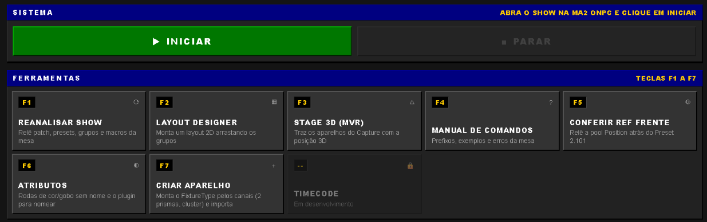

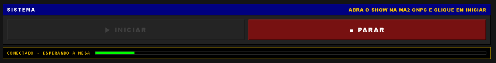

### Ferramentas (teclas F1 a F7)

| Tecla | Ferramenta | Para que serve |
|---|---|---|
| **F1** | Reanalisar show | Relê patch, presets, grupos e macros da mesa (use depois de mexer na mesa à mão) |
| **F2** | Layout Designer | Monta um Layout 2D arrastando os grupos/aparelhos e envia para a MA2 |
| **F3** | Stage 3D (MVR) | Traz os aparelhos do Capture com patch, posição 3D e Layout 2D |
| **F4** | Manual de comandos | Prefixos, exemplos e erros da mesa (o mesmo do [docs/MANUAL.md](docs/MANUAL.md)) |
| **F5** | Conferir REF FRENTE | Relê a pool Position atrás do Preset 2.101 |
| **F6** | Atributos | Encontra rodas de cor/gobo e shutter sem nome e ajuda a nomear olhando o aparelho |
| **F7** | Criar aparelho | Monta um FixtureType canal por canal (2 prismas, 3 gobos, cluster) ou copia um tipo do show, grava na biblioteca e importa |
| — | Timecode | Em desenvolvimento (trancado nesta versão) |

**F6 · Atributos** confere em cada tipo do patch se as cores, os gobos, os prismas e o shutter têm nome. Onde falta, manda o valor DMX no aparelho e você só clica no que aparece (a cor, o gobo, "strobe seco"...). No fim grava tudo no tipo da mesa, no formato da biblioteca da MA.

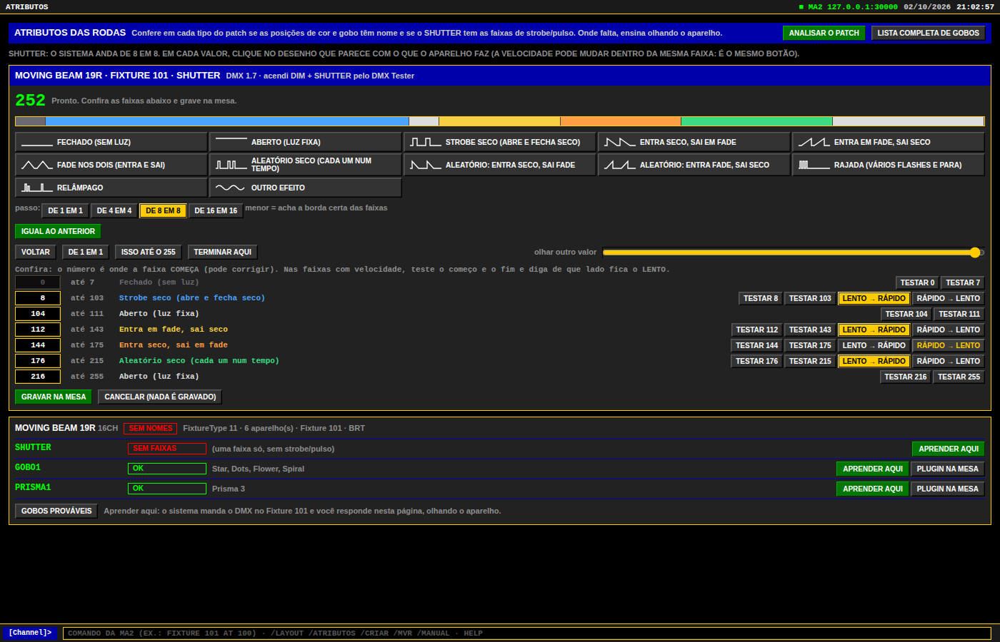

### Painel lateral: mesa, show, referência, plugins e IA

O botão **RECOLHER** esconde o painel. Antes de iniciar ele mostra "bridge parado" e "não lido". Depois de iniciar mostra a versão da mesa, o endereço, quantos aparelhos, grupos, presets, macros, efeitos e sequences o show tem, se a **REF FRENTE** está gravada, se os plugins **BRT AI v1/v2** estão instalados e qual motor de IA está em uso.

| Antes de iniciar | Show lido |
|---|---|
| 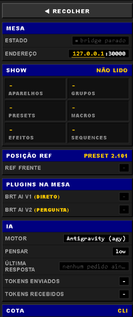 |  |

### Aviso da REF FRENTE

Quando o show tem movings (pan/tilt) e a posição de referência não está gravada, o programa avisa. Aponte os movings para a frente do palco e grave `Store Preset 2.101 "REF FRENTE"`. Depois clique em **JÁ GRAVEI · CONFERIR**.

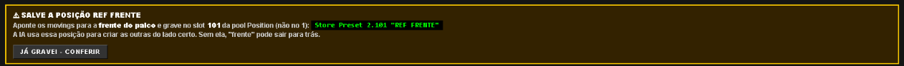

### Linha de comando da MA e terminal

No rodapé fica o `[Channel]>`. Digite um comando da grandMA2 (`Fixture 101 At 100`, `Group 3 At Preset 4.21`...) e dê Enter: ele vai direto para a mesa, com a resposta ao lado. As setas ↑↓ trazem os comandos anteriores. Atalhos: `/layout`, `/atributos`, `/criar`, `/mvr`, `/manual` abrem as ferramentas e `help` mostra a ajuda.

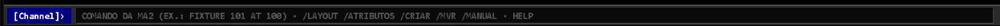

O **Terminal** mostra o que o programa está fazendo, linha por linha (com **COPIAR**, para mandar no suporte).

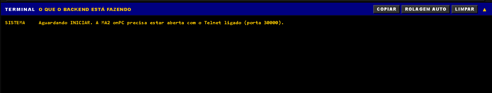

### Layout Designer (F2)

Arraste os tipos/grupos para a grade, organize e clique em **ENVIAR PARA A MA2**. O layout serve de base para os grupos de seleção (ordem física) e para o Layout Clone.

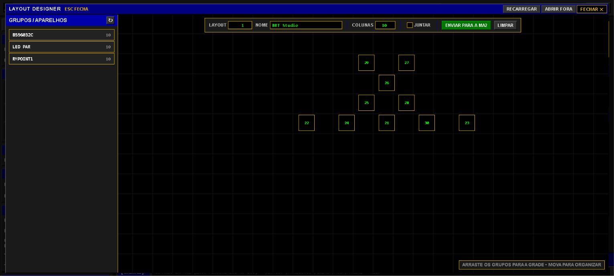

---

## Plugins que ele instala na mesa

O programa instala sozinho, no pool de Plugins da grandMA2, tudo o que usa (também com a mesa em outro PC). Para instalar ou atualizar à mão, peça **`instala os plugins`**.

| Plugin | O que faz |
|---|---|
| **BRT AI v1** | Pedido direto: você escreve, a IA executa, sem perguntas |
| **BRT AI v2** | Pedido com conversa: a IA pergunta o que falta e mostra o plano antes de executar |
| **PRISMA Painel v1.5** | O "super color picker": os grupos viram botões de seleção e cor, 2ª cor, fade, delay, FX de dimmer, FX de cor, movimento e rate vão só nos marcados |
| **PRISMA Color Picker v8** | Color picker simples no Layout: 12 cores por tipo + ALL, 2ª cor (split), fade, delay e direção |
| **PRISMA Layout Clone v4** | Copia o desenho de um aparelho de várias células (strobo cluster, barra) para os outros, no lugar de cada um |
| **PRISMA Channel Sets v3** | Dá nome às posições da roda de cor/gobo olhando o aparelho aceso (usado pela tela F6) |

Detalhes, variáveis e uso manual de cada plugin: **[docs/PLUGINS.md](docs/PLUGINS.md)**.

---

## PRISMA Control: painel, color picker, grupos e layouts prontos

Pedidos que montam estruturas inteiras de uma vez, sem caixas de pergunta. A ordem recomendada num show novo:

1. **Layout** dos aparelhos (F2 ou Stage 3D) e, se houver aparelho de várias células, **`clona o desenho do 21 para 22 a 30 no layout 1`**.
2. **`cria os grupos de seleção pelos layouts 1 2 3`**: 8 grupos por tipo (ALL, ODD, EVEN, ESQ, DIR, CENTRO, PONTAS, IN-OUT) na ordem do palco.
3. **`cria o painel`**: o "super color picker", com seleção de grupos, cor e FX. Ou **`cria o color picker`**, a grade simples de cores.
4. Opcional: **`cria os efeitos base`**, **`cria os presets de beam`**, **`cria o layout dos tipos com ícones`**.

### PRISMA Painel (o "super color picker")

Uma paleta só, e os grupos viram botões: marque o grupo (ALL, ODD, EVEN, ESQ ou DIR de cada tipo) e aperte a cor ou o efeito, que vai só nele. São dois layouts, **COR** e **FX**, com um botão para virar a página.

- **COR** (12 cores), **COR FX** (2ª cor dos efeitos de cor) e **OPOSTA** (a cor complementar com um toque).
- **FADE**, **DELAY** e **direção** (`>>` `<<` `><` `<>`), correndo pelas colunas do desenho. O delay é gravado às cegas, sem mexer no programmer.
- **FX DIM** (`>>>` `<<>>` `1/3` `2/2` `PULSO` `ONDA` `RANDOM`), **FX COR** (alterna as duas cores) e **MOVE** (`CIRCLE` `LEQUE` `ONDA` `SPREAD`), mais **RATE** e **BPM**.
- Strobo cluster de 16 células conta como **um** aparelho: o strobo inteiro pisca junto.
- Falando: `movings vermelho com fade de 2s`, `strobo ímpar magenta`, `beam vermelho e segunda cor oposta`. O programa marca os grupos e aperta os botões do painel, sem gastar a IA.

### Color picker


- **Uma linha por tipo** (o grupo "… ALL") e uma linha **ALL** para tudo. 12 cores: White, Red, Amber, Yellow, Green, Cyan, Blue, Lavender, Magenta, Pink, CTO e UV.
- **2ª cor (SPLIT):** embaixo de cada tipo, escolha a segunda cor e o padrão: **1x1** (alternado), **MET** (metades) ou **PNT** (pontas). OFF volta tudo para a cor principal.
- **FADE**, **DELAY** e **direção** (esquerda→direita, direita→esquerda, centro→fora, fora→centro) para todas as linhas.
- Depois de criado, dá para trocar de cor falando: `deixa tudo azul`, `vermelho com fade de 2s`, `âmbar da esquerda pra direita com delay de 1s`. O programa aperta o botão certo do picker, sem gastar a IA e sem criar nada novo.

### Layout Clone


Arrume **um** aparelho de várias células no layout (ex.: o desenho em cruz de um strobo de 16 células). O clone copia esse desenho para os outros, **no lugar de cada um**, aproximando os aparelhos até sobrar **1 quadrado de folga** entre um desenho e outro. Também tem modo **em grade** e **sem aproximar**. Antes de gravar, ele salva um backup do layout.

---

## Stage 3D: do Capture para a grandMA2

No console, abra **Stage 3D (MVR)** (F3) e escolha a pasta do projeto do Capture (`.mvr` + o `.c2p` do projeto, salvo normal ou como Capture 2023; o `.gltf` é opcional). Os arquivos mais recentes abrem sozinhos.

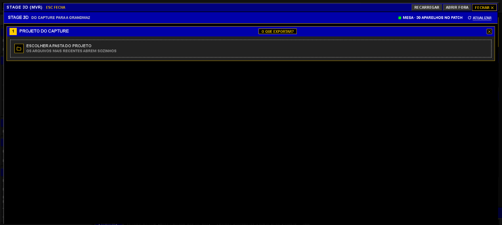

**1. Conferir.** Vista de cima e de frente (forma = tipo de aparelho; cheio = já está no show, vazado = vai ser criado), quantos aparelhos, tipos e endereços.

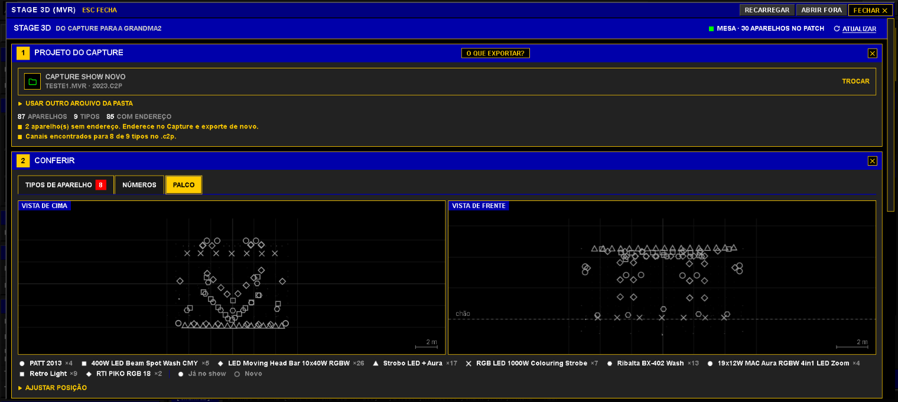

Na aba **Tipos de aparelho**, escolha o tipo da biblioteca da MA2 para cada aparelho do Capture. "Canais batem" = mesmos canais na mesma ordem. Se a MA não tiver o aparelho, clique em **CRIAR TIPO**: o programa monta o FixtureType a partir dos canais do Capture e marca o que precisa conferir.

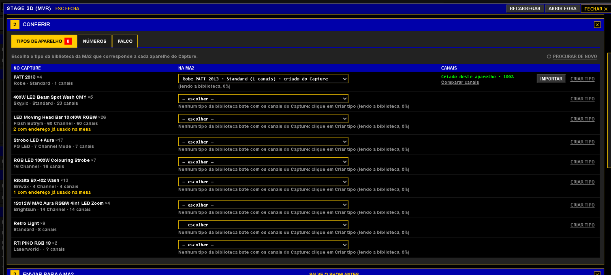

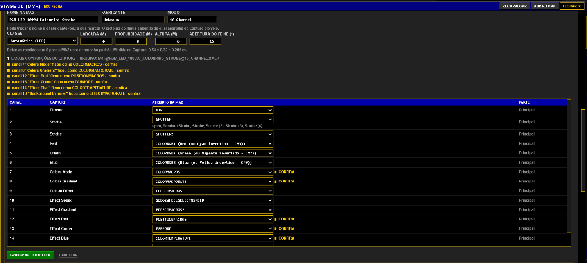

**2. Enviar para a MA2.** Três blocos: **Criar aparelhos** (IDs e endereços; endereço ocupado vai para o próximo livre), **Posicionar no palco** (posição e rotação no Stage View) e **Layout 2D** (planta vista de cima, padrão Layout 20).

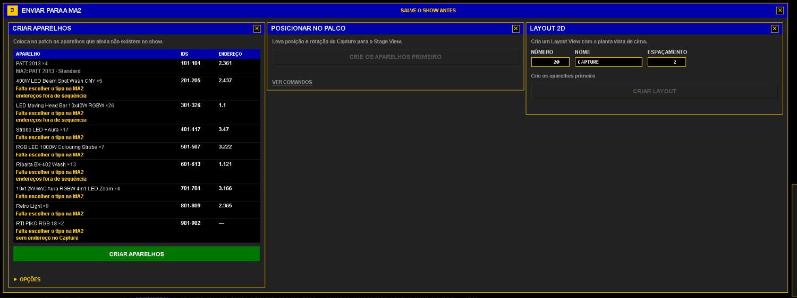

Deixe aberta na mesa a janela **Setup → Patch & Fixture Schedule** durante a criação. Espere terminar antes de posicionar:

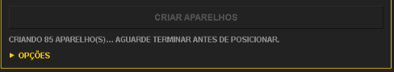

O patch fica organizado em uma camada por tipo ("CAPTURE Robin Pointe"...):

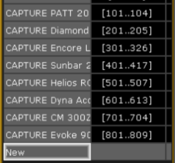

E o palco aparece no Stage View da grandMA2:

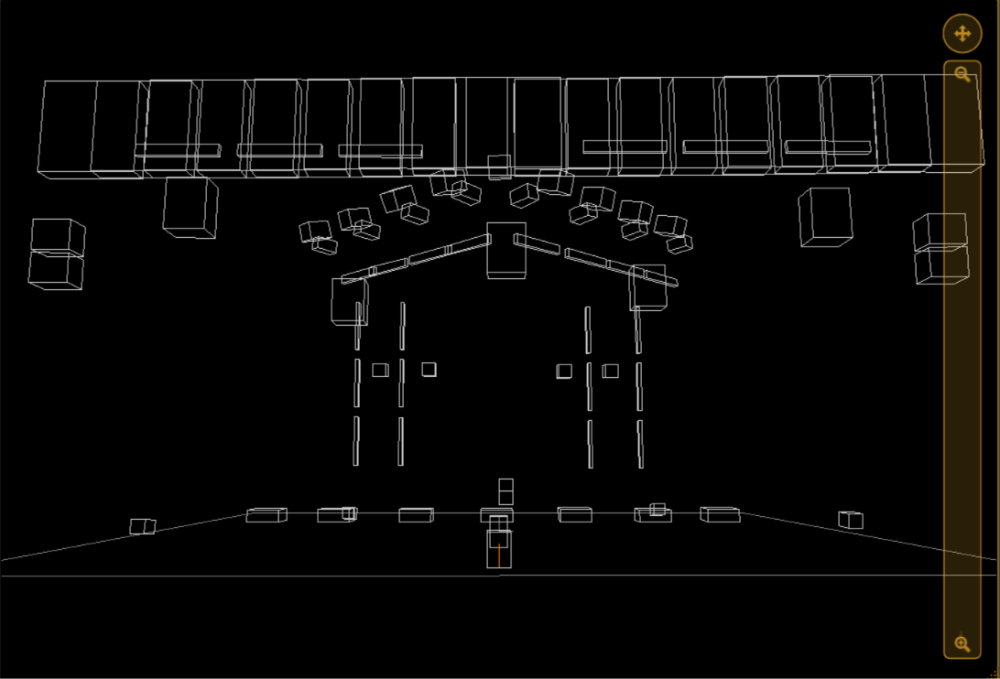

**Salve o show antes.** Enquanto o Patch está aberto, a MA2 mostra as posições como 0 0 0; isso é normal.

---

## Requisitos

- Windows 10 ou 11, 64 bits
- grandMA2 onPC 3.9 (testado na 3.9.60 e na 3.9.63), no mesmo computador **ou** em outro PC da mesma rede
- Conta Google **e** ser membro do [Studio BRT no Patreon](https://www.patreon.com/c/StudioBRT) com o mesmo e-mail (grátis por tempo limitado)
- Um motor de IA: chave da API Gemini **ou** o Antigravity CLI logado com a sua conta Google

## Instalar em 5 minutos

0. **Antes de tudo:** entre como membro no [Patreon do Studio BRT](https://www.patreon.com/c/StudioBRT) com o mesmo e-mail da sua conta Google.
1. Baixe o `PRISMA_AI_..._Setup.exe` em **[Releases](https://github.com/BRT-STUDIO01/Prisma-ai/releases/latest)**. Se o navegador disser "normalmente não é baixado": no Edge, **···** → **Manter** → **Manter assim mesmo**; no Chrome, **Manter**.
2. Rode o instalador. Se aparecer "O Windows protegeu o computador", clique em **Mais informações** → **Executar assim mesmo** (veja [por que esse aviso aparece](docs/FAQ.md#o-windows-diz-que-protegeu-o-computador-é-vírus)).
3. Aceite os termos. O programa é instalado só para o seu usuário, sem pedir administrador.
4. Abra o **PRISMA · AI**, entre com a **mesma conta Google do Patreon** e escolha o motor de IA.

   

5. Abra o show na grandMA2 onPC e clique em **INICIAR**.
6. Grave a **REF FRENTE** (se tiver movings) e faça o primeiro pedido pelo plugin **BRT AI v2**.

## Mesa em outro computador

O PRISMA · AI conversa com a grandMA2 onPC pela rede (Telnet, porta 30000). No **PC da mesa**:

1. Na grandMA2 onPC: **Setup → Console → Global Settings → Telnet = Login Enabled**.
2. No Windows, deixe a rede como **Privada** (em Rede pública o Windows bloqueia tudo).
3. Libere a porta 30000 no firewall (PowerShell como administrador):

   ```
   New-NetFirewallRule -DisplayName "grandMA2 Telnet" -Direction Inbound -Protocol TCP -LocalPort 30000 -Action Allow
   ```

No **PC do PRISMA · AI**: com o programa parado, clique em **MESA → Endereço**, digite o IP do PC da mesa (ex.: `192.168.0.11`) e clique em **INICIAR**. Os plugins são instalados pela rede se faltarem.

**Não conecta?** O "ping" costuma estar bloqueado pelo Windows e não prova nada. Teste a porta: `Test-NetConnection 192.168.0.11 -Port 30000` precisa mostrar `TcpTestSucceeded : True`.

## Atualizações e versões

O programa confere se há versão nova ao abrir (e depois a cada 3 horas), baixa sozinho e avisa quando estiver pronta. Também há o menu **Procurar atualização**.

- **1.0 RC rev 041026**: versão **1.0**, fase **RC** (*Release Candidate*: completa e em teste de campo). **rev** é a data do build (04/10/26).
- Cada correção sai como uma nova **rev**. Quando a 1.0 for considerada final, o "RC" sai do nome.

Este repositório tem **apenas os instaladores oficiais**. Não baixe o PRISMA · AI de outro lugar.

| Arquivo | Para que serve |
|---|---|
| `PRISMA_AI_..._Setup.exe` | Instalador do programa (é o que você baixa) |
| `latest.yml` e `.blockmap` | Usados pela atualização automática. Não precisa baixar. |

**Conferir se o arquivo é original:** a página de cada versão mostra o SHA-256 do instalador. No `cmd`, na pasta do download: `certutil -hashfile PRISMA_AI_1.0_RC_rev041026_Setup.exe SHA256`. O código tem que ser igual ao da página.

## Privacidade (resumo)

- Tudo roda **no seu computador**. O servidor do programa só aceita conexões da própria máquina. Com a mesa em outro PC, o programa só conversa com a grandMA2 no IP que você digitou.
- Seus pedidos e um resumo técnico do show (tipos de aparelho, atributos, grupos, IDs ocupados) vão para o provedor de IA que **você** escolheu (Google), com a **sua** conta.
- Para melhorar os agentes, o Studio BRT recebe dados de uso: e-mail, nome do computador, pedidos, resultados e erros.
- **Não** enviamos: arquivos de show, sua chave de API, senhas nem outros arquivos do seu computador.
- Você pode pedir acesso, correção ou exclusão dos seus dados pelo e-mail abaixo (LGPD, art. 18). Texto completo: **[Termos de Uso e Política de Privacidade](docs/PRIVACIDADE.md)** (o mesmo que aparece no instalador).

## Aviso importante

A IA gera comandos e **pode errar**. Salve o show antes de usar e teste antes de abrir para o público. Quem aprova e responde pelo que roda na mesa é o operador.

---

## English summary

**PRISMA · AI** is a Windows desktop app by **Studio BRT** that lets you program a **grandMA2 onPC 3.9** console in plain Portuguese. It connects over Telnet (port 30000, same PC or LAN), reads the show (patch, fixture attributes, groups, presets, free IDs), sends the request plus a technical summary to an AI engine (Google Gemini API or Antigravity CLI) and runs the resulting MA2 commands, always using free IDs so nothing is overwritten.

- **In-console plugins:** BRT AI v1 (direct) and v2 (asks and shows a plan before running), PRISMA Painel v1.5 ("super color picker": selection-group buttons + color, 2nd color, fade, delay, dimmer/color/movement FX and rate on the selected groups only; voice control such as "movings vermelho com fade de 2s"), PRISMA Color Picker v8 (12-color layout picker per fixture type, 2-color split, fade/delay/direction), PRISMA Layout Clone v4 (copies a multi-cell fixture drawing to other fixtures in place), PRISMA Channel Sets v3 (names color/gobo wheel slots by looking at the fixture).
- **Creates:** presets (pools 0–9), effects, cues/sequences/chases with executors, macros, selection groups in physical stage order (ALL/ODD/EVEN/LEFT/RIGHT/CENTER/ENDS/IN-OUT), layouts, and patch + Stage 3D + 2D layout from a **Capture (MVR)** project.
- **Access:** free for a limited time for Studio BRT Patreon members (free tier), signing in with the same Google account. Download: [latest release](https://github.com/BRT-STUDIO01/Prisma-ai/releases/latest). Docs: [command manual](docs/MANUAL.md) · [plugins](docs/PLUGINS.md) · [FAQ](docs/FAQ.md).

---

## Quem fez

O **PRISMA · AI** é desenvolvido pelo **Studio BRT**, que cria hardware e software para palco e eventos ao vivo: controle de luz, instalações interativas e tecnologia de show.

Dúvidas, sugestões ou problemas: **audiovisualbrt@gmail.com** · Vídeos: **[YouTube @BRTAPRESENTA](https://www.youtube.com/@BRTAPRESENTA)** · Patreon: **[Studio BRT](https://www.patreon.com/c/StudioBRT)**

grandMA2 é marca da MA Lighting Technology GmbH. O PRISMA · AI é um produto independente do Studio BRT, sem vínculo com a MA Lighting.

© Studio BRT. Todos os direitos reservados. Licença de uso pessoal: é proibido copiar, revender ou redistribuir.
