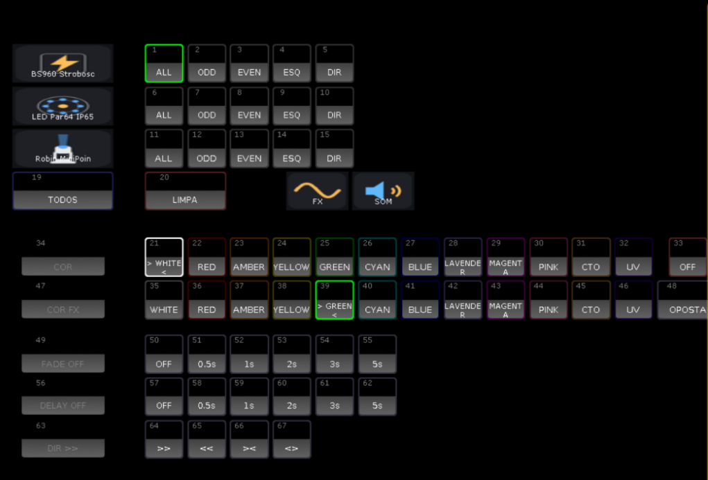
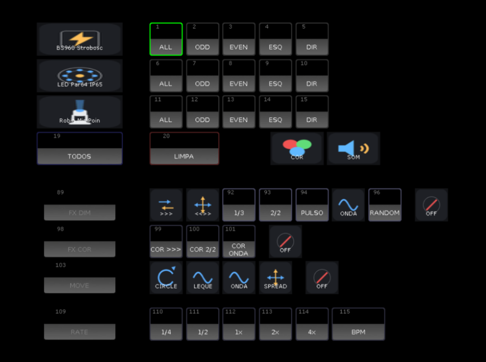
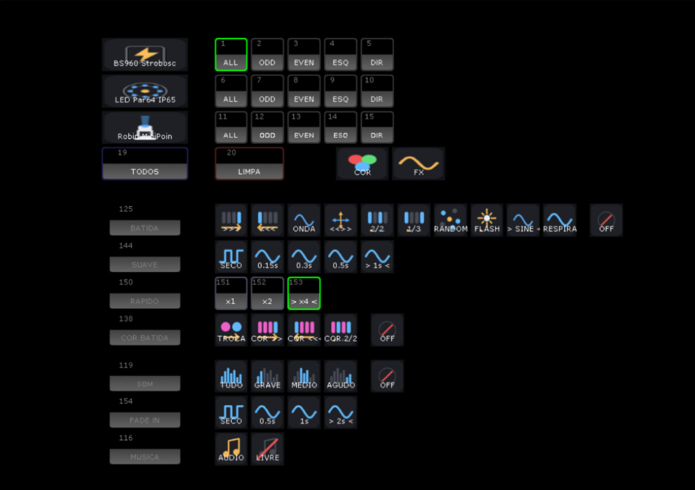

# Manual de comandos · PRISMA · AI

**O que funciona de verdade na grandMA2 onPC 3.9**, conferido em show real. Este é o mesmo manual que abre dentro do programa na tecla **F4**.

[← Voltar para o README](../README.md) · [Guia do Painel](PAINEL.md) · [Plugins](PLUGINS.md) · [Perguntas frequentes](FAQ.md)

---

## Sumário

1. [Onde pedir](#1-onde-pedir)
2. [Como pedir: prefixos](#2-como-pedir-prefixos)
3. [Lista completa: o que vai para a IA e o que não passa por ela](#3-lista-completa-o-que-vai-para-a-ia-e-o-que-não-passa-por-ela)
4. [Pedidos prontos do PRISMA Control](#4-pedidos-prontos-do-prisma-control)
5. [Plugins BRT AI v1 e v2](#5-plugins-brt-ai-v1-e-v2)
6. [Ribaltas e barras (aparelho com várias cabeças)](#6-ribaltas-e-barras-aparelho-com-várias-cabeças)
7. [Seleção e grupos](#7-seleção-e-grupos)
8. [Presets](#8-presets)
9. [Posição REF FRENTE](#9-posição-ref-frente)
10. [Efeitos](#10-efeitos)
11. [Cenas, cues e tempo](#11-cenas-cues-e-tempo)
12. [Executor, botão e chase](#12-executor-botão-e-chase)
13. [Macros](#13-macros)
14. [Vários comandos numa linha](#14-vários-comandos-numa-linha)
15. [Stage 3D (Capture) e Layout](#15-stage-3d-capture-e-layout)
16. [Mesa em outro PC](#16-mesa-em-outro-pc)
17. [Erros da mesa](#17-erros-da-mesa)
18. [Ajustes (config.env)](#18-ajustes-configenv)

---

## 1. Onde pedir

| Onde | Como |
|---|---|
| **Na mesa, plugin BRT AI v1** | Pool de Plugins → **BRT AI v1** → digite o pedido. Faz direto. |
| **Na mesa, plugin BRT AI v2** | Pool de Plugins → **BRT AI v2** → digite o pedido. Pergunta o que falta e mostra o plano. |
| **Por macro da mesa** | `SetVar $AI_PROMPT = "cor: paleta fria"` e depois `Plugin "BRT AI v1"` (ou `"BRT AI v2"`) |
| **No programa** | Linha `[Channel]>` no rodapé: manda **comandos da MA2** direto (não é pedido para a IA). `help` mostra a ajuda; `/layout`, `/atributos`, `/criar`, `/mvr`, `/manual` abrem as ferramentas. |

> Antes do primeiro pedido, clique em **INICIAR** no programa com o show aberto na mesa. O programa lê o show e instala os plugins que faltarem.

---

## 2. Como pedir: prefixos

Comece o pedido com o assunto e dois pontos. O prefixo escolhe o especialista certo e evita que a IA adivinhe. Sem prefixo também funciona: o programa escolhe pelo assunto.

| Prefixo | O que faz | Exemplo |
|---|---|---|
| `dimmer:` | Presets de dimmer (pool 1) | `dimmer: crie níveis 0, 25, 50, 75 e 100 para todos` |
| `posicao:` | Presets de posição (pool 2) | `posicao: crie um leque abrindo e um fechando nos pointes` |
| `gobo:` | Presets de gobo (pool 3) | `gobo: crie presets com os gobos dos pointes` |
| `cor:` | Paleta de cor (pool 4): roda, RGB ou scroller, conforme o aparelho | `cor: paleta de cores quentes para os pointes` |
| `beam:` `focus:` | Pools 5 e 6 (prisma, frost, zoom, foco) | `beam: zoom aberto e fechado nos pointes` |
| `preset control:` | Pool 7 (lamp, reset) | `preset control: lamp on, lamp off e reset` |
| `preset all:` | Pool 0 (vários atributos juntos) | `preset all: abertura: centro, azul, gobo aberto, dimmer 100` |
| `efeito:` | Efeito de movimento, dimmer ou cor | `efeito: círculo espelhado nos pointes, lento` |
| `cena:` `cue:` | Sequence com várias cues, tempos e executor | `cena: 4 etapas crescendo nas ribaltas, no executor 1.120` |
| `chase:` | Sequence em modo chaser com velocidade | `chase: 6 cores no led, 128 bpm, executor 1.122` |
| `cria:` | Cena/sequence genérica (só com os dois pontos; "cria ..." sozinho é só o verbo) | `cria: blackout geral no executor 1.130` |
| `macro:` | Macros novas (as suas não são apagadas) | `macro: botão que salva o show` |
| `grupo:` | Grupos de aparelhos | `grupo: um grupo para cada tipo de aparelho` |
| `layout:` | Layout 2D | `layout: pointes em linha` |
| `laser:` | Laser com ClipSelect (só se tiver laser no patch) | `laser: 4 cues com clips diferentes` |
| `patch:` | Só responde sobre o rig, não cria nada | `patch: quais aparelhos têm cor e quais têm gobo` |
| `ajuda:` | Não cria nada. Explica a MA2 **e monta pedidos prontos** com os aparelhos, grupos e presets do seu show | `ajuda: como peço uma abertura de show?` |
| `analise` | Relê o show inteiro (depois de mexer na mesa à mão). Igual à tecla F1. | `analise` |
| `timecode:` | Trancado nesta versão (em desenvolvimento) | — |

Pergunta sem verbo de ação (termina com "?" ou começa com "como", "o que", "qual") vai para a **ajuda** e não cria nada.

Pedido impossível no seu rig (facas, vídeo, laser sem o aparelho no patch) é recusado na hora, sem gastar a IA.

### Um pedido bom tem 4 partes

**O que** criar + **em quem** (grupo ou fixtures) + **quantos** + **clima ou velocidade**.

```
chase: 6 cores nas ribaltas, 120 bpm, no executor 1.122
posicao: leque abrindo e fechando nos pointes (Fixture 11 Thru 20)
efeito: dimmer correndo por cabeca nas ribaltas, lento
```

Sem ideia de como pedir? Mande `ajuda: como peço ...`: a ajuda devolve 2 a 4 pedidos prontos para copiar, já com os números do seu show.

---

## 3. Lista completa: o que vai para a IA e o que não passa por ela

O PRISMA tem dois caminhos. Os **pedidos prontos** (painel, grupos, plugins, clone, atalhos de cor...) o próprio programa reconhece e faz na hora: **não gastam a IA**, não fazem pergunta e respondem em segundos. **Todo o resto** vai para a IA, que monta os comandos com o seu show.

### 3.1 Pedidos que o programa faz sozinho (sem IA)

Funcionam igual no BRT AI v1 e no v2 (e por macro). Detalhes de cada um na seção 4.

| Pedido (exemplos que funcionam) | O que faz |
|---|---|
| `instala os plugins` · `atualiza os plugins` · `traz os plugins pra mesa` | Põe no pool de Plugins o que faltar (BRT AI v1/v2, Painel v2.8, Layout Clone v4, Channel Sets v3) e tira as versões velhas |
| `plugin clone` · `plugin painel` · `plugin color picker` · `plugin channel sets` | Instala o que faltar e diz como usar aquele plugin |
| `cria os grupos de seleção` · `cria os grupos pelos layouts 1 2 3` · `crie grupos para o color picker usando layout 1 2 3` | 8 grupos por tipo (ALL, ODD, EVEN, ESQ, DIR, CENTRO, PONTAS, IN-OUT) na ordem do palco, a partir do 101 |
| `cria os grupos pelos layouts 1 2 3 e cria o painel` | Os grupos e, em seguida, o painel |
| `reordena os grupos pelo layout 1` · `arruma a ordem dos grupos 1 a 8 pelo palco` | Regrava os grupos com os mesmos aparelhos, na ordem física |
| `cria o painel` · `cria o color picker` · `seletor de cores` · `super color picker` · `paleta de cores no layout` · `painel de cor` | Cria o **PRISMA Painel v2.8** (páginas COR, FX e SOM). Se já existe, apaga o antigo e põe o novo no lugar |
| `refaz o painel` · `recria o painel` · `atualiza o painel` | O mesmo, deixando claro que é para substituir |
| `cria o painel na pagina 5` · `color picker dos grupos 101 e 111 na pagina 2` | Painel em outra página de executores / só com esses grupos |
| `movings vermelho com fade de 2s` · `strobo ímpar magenta` · `par led da esquerda verde` · `grupo 113 âmbar` | Com o painel no show: marca os grupos e aperta COR e FADE |
| `tudo uv com delay 2s do centro pra fora` · `delay de 1s da esquerda pra direita` · `sem fade` · `sem delay` | Marca e aperta DELAY e DIR (`>>` `<<` `><` `<>`) |
| `beam vermelho e segunda cor oposta` · `cor fx azul nos beams` · `segunda cor verde` | Aperta COR FX ou OPOSTA |
| `fx no ritmo da musica` · `fx no bpm` · `fx no bpm livre` | Os FX do painel (dimmer, cor, movimento) no BPM da janela Sound Input / de volta ao RATE |
| `clona o desenho do 21 para 22 a 30 no layout 1` (`em grade`, `sem aproximar`, `e salva no layout 5`) | Layout Clone: copia o desenho de um aparelho de várias células para os outros |
| `cria o layout dos tipos com ícones` · `prisma tipos` | Layout com um botão por tipo de aparelho, com ícone |
| `importa os ícones do prisma` · `importa os ícones de aparelho` · `importa os ícones de função` | Ícones no Image pool (aparelho a partir do 301, função a partir do 1200) |
| `cria os efeitos base` · `cria os efeitos de movimento e dimmer` | Pacote de efeitos a partir do 901 (Circle, Tilt Leque, Pan Wave, Spread, Dim Chase, Dim Onda, Dim+Pos) |
| `cria os presets de beam` · `cria os presets de zoom e frost` | Pool 5 a partir do 101: zoom, íris e frost, só em quem tem o atributo |
| `analise` · `análise` · `analisar` · `resync` | Relê o show inteiro (igual à tecla F1) |
| `testa o som` | Diagnóstico do Sound Input para o suporte: lê os masters de som e testa por alguns segundos o executor da BATIDA do 1º grupo (depois volta como estava). Use só fora do show |
| Pedido impossível no seu rig (`facas`, `vídeo`, `laser` sem o aparelho no patch) | Recusado na hora, sem gastar a IA |

> "Cria UM efeito de dimmer chase nos leds" ou "cria um preset de zoom aberto" (um item só) **não** é pacote pronto: vai para a IA.

### 3.2 Pedidos que vão para a IA

Use um prefixo (seção 2) para escolher o especialista; sem prefixo, o programa escolhe pelo assunto. Exemplos que funcionam:

| Área | Exemplos |
|---|---|
| Dimmer | `dimmer: crie níveis 0, 25, 50, 75 e 100 para todos` |
| Posição | `posicao: leque abrindo e fechando nos pointes` · `posicao: todos para a plateia` (a partir da REF FRENTE) |
| Cor | `cor: paleta de cores quentes para os pointes` · `cor: 30 cores no led` |
| Gobo, beam, focus | `gobo: presets com os gobos dos pointes` · `beam: zoom aberto e fechado nos pointes` · `focus: foco no centro` |
| Control e All | `preset control: lamp on, lamp off e reset` · `preset all: abertura: centro, azul, gobo aberto, dimmer 100` |
| Efeito | `efeito: círculo espelhado nos pointes, lento` · `efeito: dimmer correndo por cabeça nas ribaltas` |
| Cena e cue | `cena: 4 etapas crescendo nas ribaltas, no executor 1.120` · `cue: blackout com fade de 3s` |
| Chase | `chase: 6 cores no led, 128 bpm, executor 1.122` |
| Criação genérica | `cria: blackout geral no executor 1.130` |
| Macro | `macro: botão que salva o show` |
| Grupo e layout | `grupo: um grupo para cada tipo de aparelho` · `layout: pointes em linha` |
| Laser | `laser: 4 cues com clips diferentes` (só com laser no patch) |
| Painel (efeitos) | `batida 2/2 nos strobos` · `nivel som grave nos leds` · `move circle nos movings` (a IA recebe o mapa dos botões do painel) |
| Só responder | `patch: quais aparelhos têm cor e quais têm gobo` · `ajuda: como peço uma abertura de show?` · qualquer pergunta terminada em `?` ou começando com "como", "o que", "qual" |

No **BRT AI v2** a IA pergunta o que falta e mostra o plano antes de executar; no **v1** ela decide e executa (seção 5).

### 3.3 Comandos que não são pedido

| Onde | O que digitar | O que faz |
|---|---|---|
| Linha `[Channel]>` no rodapé do programa | Qualquer comando da grandMA2 (`Fixture 101 At 100`, `Group 3 At Preset 4.21`) | Vai direto para a mesa, com a resposta ao lado. Setas ↑↓ trazem os anteriores |
| Linha `[Channel]>` | `help` · `/layout` · `/atributos` · `/criar` · `/mvr` · `/manual` | Ajuda e atalhos que abrem as ferramentas |
| Teclado do programa | **F1** a **F7** | Reanalisar · Layout Designer · Stage 3D · Manual · conferir REF FRENTE · Atributos · Criar aparelho |
| Linha de comando da MA2 ou macro | `SetVar $AI_PROMPT = "cor: paleta fria"` e depois `Plugin "BRT AI v1"` (ou `"BRT AI v2"`) | Faz o pedido sem abrir a caixa do plugin |
| Na mesa | Botões do PRISMA Painel (layouts COR, FX e SOM) | São macros da própria mesa: não passam pelo programa nem pela IA |

---

## 4. Pedidos prontos do PRISMA Control

Estes pedidos montam estruturas inteiras de uma vez, **sem caixas de pergunta** e sem gastar a IA para gerar comando por comando. Funcionam igual no v1 e no v2.

### Ordem recomendada num show novo

| Passo | Pedido | Resultado |
|---|---|---|
| 1 | (F2 Layout Designer ou F3 Stage 3D) | Aparelhos desenhados num Layout |
| 2 | `clona o desenho do 21 para 22 a 30 no layout 1` | Desenho do aparelho de várias células copiado para os outros |
| 3 | `cria o painel` ou `cria o color picker` | PRISMA Painel (o color picker do PRISMA): seleção de grupos + cor, 2ª cor, fade, delay, FX de dimmer, cor e movimento, e a página SOM com efeitos que batem com a música. Se faltar, cria antes os 8 grupos de seleção por tipo, lendo os layouts sozinho |
| 3b | `refaz o painel` (se mudar o desenho ou os grupos) | Apaga o painel antigo e cria o novo no lugar, sem duplicar |
| 5 | `cria os efeitos base` · `cria os presets de beam` | Efeitos e presets de feixe prontos |

### Tabela completa

| Pedido (exemplos que funcionam) | O que faz |
|---|---|
| `instala os plugins` · `atualiza os plugins` | Coloca no pool de Plugins tudo o que o PRISMA usa (BRT AI v1/v2, Painel v2.8, Layout Clone v4, Channel Sets v3), só o que faltar, e apaga do pool as versões velhas: todo "PRISMA Color Picker" (v7, v8...) e Painel/Layout Clone/Channel Sets que não são a versão atual. A resposta lista "Removidos (versão velha): ...". |
| `cria os grupos de seleção` · `crie grupos para o color picker` | 8 grupos por tipo de aparelho (ALL, ODD, EVEN, ESQ, DIR, CENTRO, PONTAS, IN-OUT) na ordem do desenho. O PRISMA lê todos os layouts do show e cada tipo usa o layout onde está desenhado; sem layout com aparelhos, usa a posição 3D. Números a partir de 101, um bloco de 10 por tipo. Pedir de novo regrava nos mesmos números. O painel faz isso sozinho quando faltam os grupos. |
| `cria os grupos de seleção pelos layouts 1 2 3` · `cria os grupos pelos layouts 1 2 3 e cria o painel` | Igual, procurando só nos layouts citados. Com "e cria o painel" (ou "e cria o color picker"), monta o painel em seguida. |
| `reordena os grupos pelo layout 1` · `arruma a ordem dos grupos 1 a 8 pelo palco` | Regrava os grupos existentes com os mesmos aparelhos, só na ordem física. Conserta efeito/delay correndo fora de ordem. |
| `cria o painel` · `cria o color picker` · `cria o super color picker` · `seletor de cores` · `paleta de cores no layout` | Todos criam o mesmo PRISMA Painel v2.8: os grupos de seleção viram botões (marca e fica marcado) e cor, 2ª cor, fade, delay, FX de dimmer, FX de cor, movimento, rate e os efeitos de som vão só nos marcados. Três layouts (COR, FX e SOM), executores na página 99. Precisa dos grupos de seleção (cria sozinho se faltar). |
| `refaz o painel` · `recria o painel` · `atualiza o painel` | Se o show já tem painel, qualquer pedido de painel (inclusive `cria o painel` e `cria o color picker`) apaga o antigo antes (macros, layouts "PRISMA Painel", sequences, presets e efeitos "PPN ...", e desliga os executores dele) e cria o novo no lugar. Painel v1.4 antigo: as macros de cor antigas ficam no pool (apague à mão). |
| `fx no ritmo da musica` · `fx no bpm` · `fx no bpm livre` | Os FX do painel (dimmer, cor, movimento) andam no BPM da janela Sound Input da mesa (Special Master 3.16 "BPM"; o Snd In precisa deixar a mesa ouvir a música). `fx no bpm livre` volta para o RATE de cada um. É o mesmo que os botões MUSICA `AUDIO` / `LIVRE` da página SOM. |
| `cria o painel na pagina 5` | O mesmo, com os executores na página 5. |
| `movings vermelho com fade de 2s` · `strobo ímpar magenta` · `tudo uv com delay 2s do centro pra fora` · `beam vermelho e segunda cor oposta` | Com o painel no show: marca os grupos e aperta os botões do painel. Não cria nada. |
| `color picker dos grupos 101 e 111 na pagina 2` | Painel só com as linhas desses grupos, executores na página 2. |
| `deixa tudo azul` · `vermelho com fade de 2s` · `âmbar da esquerda pra direita com delay de 1s` | Com o painel no show: aperta os botões do painel (cor, fade, delay, direção). Show antigo que ainda tem um Color Picker v8 criado antes (e sem painel): aperta os botões dele. Não cria nada. |
| `clona o desenho do 21 para 22 a 30 no layout 1` | Layout Clone: copia o desenho do aparelho 21 (todas as células) para 22 a 30, no lugar de cada um, aproximando com 1 quadrado de folga. |
| `clona o desenho do 21 para 22 a 30 no layout 1 em grade` | Mesma cópia, mas em grade (5 por linha). |
| `clona o desenho do 21 para 22 a 30 no layout 1 sem aproximar` | No lugar, mantendo o espaço original. |
| `clona o desenho do 1 para 2 a 12 no layout 3 e salva no layout 5` | Lê o modelo no layout 3 e grava o resultado no layout 5. |
| `cria o layout dos tipos com ícones` · `prisma tipos` | Layout com um botão por tipo de aparelho, com o ícone do tipo; clicou, seleciona o tipo. |
| `importa os ícones do prisma` | Ícones de aparelho (Image pool a partir de 301) e de função (a partir de 1200). Usa bloco livre e não duplica. |
| `cria os efeitos base` | Efeitos a partir do 901: Circle, Tilt Leque, Pan Wave, Spread (wings 2), Dim Chase, Dim Onda e Dim+Pos. Movimento só se o show tem movings. |
| `cria os presets de beam` | Pool 5 a partir do 101: Zoom Fechado/Médio/Aberto, Íris Aberta/Fechada, Frost Off/Full, só nos aparelhos que têm o atributo. |

> **Ordem física (colunas):** os grupos de seleção seguem o desenho do layout, da esquerda para a direita. Num desenho em **andares** (a maioria das colunas com 2 ou mais aparelhos, ex.: LED em cima e embaixo), os aparelhos um em cima do outro formam uma coluna: acendem juntos no efeito e no delay, e ODD/EVEN contam por coluna. Numa **fila**, cada aparelho é uma coluna, mesmo que dois estejam encostados. Aparelho de várias células (strobo cluster) conta pelo centro do desenho dele. O `reordena os grupos` continua usando a numeração quando o desenho é cobra, V ou zigue-zague.

### Usando o color picker na mesa

O color picker do PRISMA é o **PRISMA Painel** (tabela abaixo). O antigo Color Picker v8 foi aposentado: um picker v8 já criado num show continua funcionando, mas `cria o color picker` agora monta o Painel. Para tirar as versões velhas do pool de Plugins, peça `instala os plugins`.

### Usando o PRISMA Painel na mesa

O painel tem **três páginas** (layouts "PRISMA Painel COR", "FX" e "SOM"). Em todas, em cima, a **seleção**: uma linha por tipo `[TIPO] [ALL] [ODD] [EVEN] [ESQ] [DIR]`, um marcado por tipo (verde); `TODOS` marca o ALL de todos, `LIMPA` desmarca; os botões **COR**, **FX** e **SOM** viram a página. Tudo abaixo vale só para os marcados. O botão escolhido em cada linha mostra `> NOME <`.

Cada quadrado explicado em detalhe: **[Guia do Painel](PAINEL.md)**.

**Página COR**



| Linha | O que faz |
|---|---|
| **COR** / **OFF** | 12 cores. OFF solta a cor dos marcados. |
| **COR FX** / **OPOSTA** | 2ª cor dos efeitos de cor. OPOSTA = cor complementar da COR atual. |
| **FADE** · **DELAY** · **DIR** | Tempo da troca de cor (OFF a 5 s) e delay entre aparelhos, por coluna: `>>` `<<` `><` `<>`. O delay é gravado às cegas (não mexe no programmer). |

**Página FX** (efeitos sem som)



| Linha | O que faz |
|---|---|
| **FX DIM** | `>>>` `<<>>` `1/3` `2/2` `PULSO` `ONDA` `RANDOM` `OFF` |
| **FX COR** | `COR >>>` `COR 2/2` `COR ONDA` `OFF` (alterna COR e COR FX; trocar a cor não para o efeito) |
| **MOVE** | `CIRCLE` `LEQUE` `ONDA` `SPREAD` `OFF` (tipos com pan/tilt) |
| **RATE** · **BPM** | `1/4` a `4x` e BPM digitado (60 = normal) nos FX dos marcados |

**Página SOM** (tudo que bate com a música, pelo Sound Input da MA2)



| Linha | O que faz |
|---|---|
| **BATIDA** | `>>>` `<<<` `ONDA` `<<>>` `2/2` `1/3` `RANDOM` `FLASH` `SINE` `SINE SOM` `RESPIRA` `OFF`: o desenho anda um passo por batida da música, pelas colunas. SINE = onda lisa correndo no BPM da música; SINE SOM = a mesma onda correndo sem parar, que acende na batida (com fade) e volta devagar; RESPIRA = sobe na batida e desce sozinho |
| **SUAVE** | `SECO` `0.15s` `0.3s` `0.5s` `1s`: transição entre os passos |
| **RAPIDO** | `x1` `x2` `x4`: x1 = um passo por batida que a mesa pega (ela costuma pegar metade); x2 = no tempo da música; x4 = o dobro (chaser no BPM do Sound Input). No SINE: x1 = metade do BPM, x2 = BPM, x4 = dobro |
| **COR BATIDA** | `TROCA` `COR >>>` `COR <<<` `COR 2/2` `OFF`: COR e COR FX trocando na batida |
| **NIVEL SOM** | `TUDO` `GRAVE` `MEDIO` `AGUDO` `OFF`: o dimmer segue o volume da faixa (todos juntos). Desliga a BATIDA (mesmo dimmer) |
| **FADE IN** | `SECO` `0.5s` `1s` `2s`: entrada sem flash ao trocar de efeito |
| **MUSICA** | `AUDIO` / `LIVRE`: os FX da página FX no BPM do Sound Input / de volta ao RATE |

Na janela **Sound Input** da mesa, deixe o **Snd In** baixo (uns 5 a 15%): alto demais, todas as faixas ficam no pico. O **Snd Fade** suaviza a resposta ao som.

Mudou o desenho ou os grupos? Peça os grupos de seleção de novo e depois `refaz o painel`: o antigo é apagado e o novo entra no lugar (as fases e os delays ficam gravados nas cues, por isso precisa refazer). Atualizou o PRISMA? Peça `refaz o painel` para receber o painel novo. As variáveis do painel (SetVar) ficam salvas no show: depois de reabrir o show, ele continua funcionando.

---

## 5. Plugins BRT AI v1 e v2

| | BRT AI v1 (direto) | BRT AI v2 (conversa) |
|---|---|---|
| Pergunta? | Nunca. Escolhe sozinho: usa o Group do tipo pedido; sem grupo, todos os aparelhos daquele tipo. | Pergunta o que falta (quais aparelhos, tonalidade, quantas etapas) ou mostra a lista do que vai criar. |
| Aprovação | Não. Executa e mostra o resultado. | Mostra o plano e espera você aprovar. |
| Quando usar | Pedido claro, correria de show. | Quando você quer escolher os detalhes. |

### Respondendo a lista do v2

Quando aparecer `Vou criar 8 presets de Color (RED, GREEN, ...) para as Fixtures 201 Thru 218.`, responda:

- `ok` (ou vazio): cria exatamente aquela lista, sem chamar a IA de novo
- `tira a rosa` / `troca o verde por lima` / `acrescenta um lilas`: refaz só com a mudança

Mais detalhes em [PLUGINS.md](PLUGINS.md).

---

## 6. Ribaltas e barras (aparelho com várias cabeças)

Ao ler o show, o sistema conta as cabeças de cada tipo (ex.: DTW Bar = 12, de 1.1 a 1.12; strobo BS960 = 16, de 21.1 a 21.16).

```
Fixture 1                                  (as 12 cabeças juntas)
Fixture 1.3                                (só a 3ª cabeça)
Fixture 1.1 Thru 1.12                      (uma a uma, em ordem)
Fixture 1.1 Thru 1.12 + 2.1 Thru 2.12      (cabeças de duas ribaltas, em ordem)
```

**NÃO:** `Fixture 1.1 Thru 10.12`: a mesa recusa o Thru de uma ribalta para outra.

Escreva **por cabeça** no pedido (chase, efeito, cor alternada) para a IA trabalhar cabeça a cabeça. No layout, cada cabeça vira um quadrado em linha; use o **Layout Clone** para copiar um desenho (cruz, círculo) de um aparelho para os outros.

---

## 7. Seleção e grupos

```
ClearAll
Fixture 101 Thru 112
Fixture 1 Thru 10 + 101 Thru 112
Fixture 14 + 12 + 10 Thru 8          (a ordem escrita é a ordem da seleção)
Group 4
Store Group 5 "POINTES"
Store Group 5 /o /nc                 (regrava por cima, sem perguntar)
```

**NÃO:** `Group 21 Thru 40` seleciona grupos, não aparelhos (Error #72).

A ordem da seleção gravada no grupo é a ordem em que efeito, fase e delay correm. Por isso os grupos de seleção do PRISMA são gravados na ordem do palco.

---

## 8. Presets

| Pool | Tipo | Pool | Tipo |
|---|---|---|---|
| 0 | All | 5 | Beam |
| 1 | Dimmer | 6 | Focus |
| 2 | Position | 7 | Control |
| 3 | Gobo | 8 | Shapers |
| 4 | Color | 9 | Video |

```
ClearAll ; Fixture 101 Thru 112 ; Attribute "Pan" At 0 ; Attribute "Tilt" At 20 ; Store Preset 2.9 "CENTRO" ; ClearAll
ClearAll ; Fixture 201 Thru 218 ; Attribute "Dim" At 60 ; Store Preset 1.6 "RIBALTA 60" ; ClearAll
```

- `Store Preset 2.9 "NOME"` grava e dá nome num comando só.
- Use o atributo que o aparelho tem: moving de roda usa `COLOR1`, LED e ribalta usam `ColorRGB1..3`, scroller usa `SCROLLER`.
- **Cor com LED + moving de disco:** o LED entra em todas as cores. O moving só entra no preset cuja cor existe no disco dele. Pedindo 30 cores com um disco de 8, o moving fica só nos que batem. Nunca valor entre duas cores do disco.
- O sistema troca sozinho para o próximo ID livre se o pedido cair em cima de um preset seu.

---

## 9. Posição REF FRENTE

A IA não sabe como cada moving está montado: `Tilt At -30` pode ser frente num e fundo no outro. Por isso existe a posição de referência.

1. Aponte os movings para a **frente do palco**.
2. Grave no slot **101** da pool Position (não no 1): `Store Preset 2.101 "REF FRENTE"`
3. Pronto. Antes de cada pedido de posição, cena ou efeito o sistema relê a pool 2; não precisa reanalisar o show.

```
ClearAll ; Fixture 101 Thru 112 ; Preset 2.101 ; Attribute "Tilt" At + 15 ; Store Preset 2.9 "PLATEIA" ; ClearAll
```

Com a REF gravada, a IA monta as posições a partir dela com ajuste relativo (`At + 15`), nunca com valor absoluto. "Frente" é a própria REF. O programa mostra um aviso enquanto houver aparelhos com pan/tilt e a REF não estiver gravada (tecla **F5** confere).

---

## 10. Efeitos

### Receita testada

```
ClearAll
Fixture 101 Thru 112
MAtricksWings 2
Attribute "Pan" At EffectForm 8
Attribute "Pan" At EffectPhase 0 Thru 360
Attribute "Tilt" At EffectForm 9
Attribute "Tilt" At EffectPhase 0 Thru 360
Attribute "Pan" At EffectBPM 20
Attribute "Tilt" At EffectBPM 20
Store Effect 14 /nc
Label Effect 14 "CIRCULO"
MAtricksReset
ClearAll
```

### Formas (número desta mesa)

| N | Forma | Uso | N | Forma | Uso |
|---|---|---|---|---|---|
| 1 | Stomp | batida (não é seno!) | 10 | Ramp Plus | sobe e reseta |
| 3 | Random | aleatório | 11 | Ramp Minus | cai e reseta, cascata |
| 4 | Pwm | liga/desliga, chase de dimmer | 19 | Circle | círculo |
| 8 | Sin | onda, respiração | 22 | Wave | onda |
| 9 | Cos | seno adiantado 90 graus | 23 | Cross | cruzado |

- Toda camada com `Attribute "X"` na frente. `EffectPhase 0 Thru 360` sozinho cria uma linha extra (DIST) no efeito.
- Pan e Tilt são relativos: `EffectLow -20` / `EffectHigh 20` balança em volta da posição atual. Dimmer é absoluto: 0 a 100.
- Círculo: Pan 8 + Tilt 9, mesma fase e o mesmo BPM nos dois.
- Fase `0 Thru 360` faz a onda correr; fase 0 em todos = todo mundo junto.
- `MAtricksWings 2` espelha as metades, `MAtricksBlocks 2` anda em pares. Sempre termine com `MAtricksReset`.
- Efeito numa cue: `Group 101 ; At Effect 14 ; Store Sequence 50 Cue 1 /nc`.
- BPM depois de gravado: `Assign EffectBPM 140 Effect 14`.

**NÃO:** `Assign Effect 1 /wings=2` e `Assign Effect 1 /Attribute=...` não existem.

---

## 11. Cenas, cues e tempo

```
ClearAll ; Fixture 101 Thru 112 ; Preset 4.3 ; Preset 2.1 ; At 80
Store Sequence 120 Cue 1 "INTRO" Fade 3 /nc
Store Sequence 120 Cue 2 "PICO" Fade 0.5 Delay 1 /nc
Label Sequence 120 "ABERTURA"
```

- Sempre `Sequence N` na frente da cue. `Store Cue 120.2` vira a cue 120.2 da sequence selecionada, não a Sequence 120.
- Cue com número quebrado entra no meio: `Cue 2.5` fica entre a 2 e a 3.
- Cue chamando `Preset 4.3` em vez de valor solto: mudou o preset, todas as cues mudam junto.

**Leque de tempo (antes do Store):** `Fade 1 Thru 4` · `Delay 0 Thru 2`. Cada aparelho da seleção ganha um tempo diferente: a cor "escorre" pelo rack.

**Mudar o tempo de uma cue já gravada:**

```
Assign Sequence 120 Cue 2 /fade=4 /delay=0.5
Assign Sequence 120 Cue 2 /outfade=1 /outdelay=0
Assign Sequence 120 Cue 2 /info="entra com o bumbo"
```

**Cue que entra sozinha:**

```
Assign Sequence 120 Cue 2 /trig=follow
Assign Sequence 120 Cue 3 /trig=time /trigtime=3
```

`follow` = entra quando a anterior termina. `time` = entra N segundos depois. Conferir: `ChangeDest Sequence 120 Cue 2` e `List`.

---

## 12. Executor, botão e chase

```
Store Page 2 /nc
Assign Sequence 122 At Executor 1.122
Assign Flash Executor 1.122
Assign Executor 1.122 /chaser=on
Speed 128 Executor 1.122
Rate 2 Executor 1.122
```

| Função do botão | Faz |
|---|---|
| `Assign Go Executor P.E` | entra a cena e fica |
| `Assign Flash Executor P.E` | acende só enquanto aperta: ataque, blinder, golpe |
| `Assign Toggle Executor P.E` | liga e desliga no mesmo botão |

- Opções que a mesa aceitou: `/chaser=on` `/autofix=on` `/priority=htp` `/priority=high` `/autostart=on` `/autostop=on` `/ooo=on` `/restart="First Cue"`
- `Speed 128 Executor X` = velocidade do chase. `Rate 2 Executor X` = tudo no dobro da velocidade (efeito, fade); `Rate 1` volta ao normal.
- Pular para uma cue com o tempo dela: `Goto Executor 1.122 Cue 3`.

**NÃO:** `/speed=120` (Error #7), `/rate=` e `/swop=` (Error #66). Velocidade é com `Speed N Executor P.E`.
**NÃO:** `Go+ Executor 1.120` (Error #72). **OK:** `Go+ Sequence 120`, `Goto Sequence 120 Cue 3`, `Flash Sequence 120`.
**NÃO:** executor numa page que não existe = Error #14. Crie antes com `Store Page N /nc`.

---

## 13. Macros

```
CD Macro
Store 11 "SALVAR"
Store 11.1 "SaveShow /nc"
CD /
```

- Vários comandos numa linha de macro: `ClearAll ; Fixture 1 Thru 10 ; At 100`, com espaço dos dois lados do `;`. Sem o espaço, a mesa roda só o primeiro.
- Macros expandem variáveis: `Delay 0 Thru $PCP_DELAY`. O valor de um `SetVar` não pode ter `;`.
- O sistema nunca apaga macro sua: se o número estiver ocupado, grava no próximo livre.

---

## 14. Vários comandos numa linha

```
ClearAll ; Fixture 7 ; Move3D At -6.548 -0.97 7.11 ; Rotate3D At 0 0 -180 ; ClearAll
```

- A mesa aceita `a ; b ; c` e é bem mais rápido que um por vez. O sistema já manda assim, até ~1000 letras por linha (a mesa executa só ~1024 letras de cada linha do Telnet e descarta o resto em silêncio).
- Mexer na mesa (clicar num preset, abrir um plugin) enquanto uma linha longa roda faz a mesa largar o resto da linha. O sistema percebe e reenvia do ponto certo.
- Colar várias linhas de uma vez na linha de comando da MA2 dá **Error #3 ILLEGAL CHARACTER**: só a primeira roda. Junte tudo numa linha com ` ; `.
- Se um comando falha, a mesa abandona o resto da linha. O sistema percebe e manda o que faltou na linha seguinte.
- `Delete` sempre com `/nc`. Sem ele abre uma janela de confirmação e a conexão trava.
- `Echo` não existe na MA2 (Error #1).

---

## 15. Stage 3D (Capture) e Layout

**3 passos** na tela F3 (veja as imagens no [README](../README.md#stage-3d-do-capture-para-a-grandma2)):

1. **Projeto do Capture:** escolha a pasta do projeto. O arquivo mais novo abre sozinho (`.mvr` traz posição e patch; o `.c2p` traz o nome de cada canal).
2. **Conferir:** mapas de cima e de frente, o tipo da biblioteca MA2 de cada aparelho ("canais batem" = mesmos canais na mesma ordem; senão **CRIAR TIPO**) e os números. **Numerar** continua de onde a mesa parou e mantém os IDs digitados à mão. "Ajustar posição" corrige a origem e a escala.
3. **Enviar para a MA2:** Criar aparelhos, Posicionar no palco e Layout 2D.

### Criar aparelhos

- Deixe aberta na mesa a janela **Setup → Patch & Fixture Schedule**. Sem ela a MA2 ignora a camada. Depois feche e responda **SIM**.
- Cria uma camada por tipo ("CAPTURE Robin Pointe"...) com ID, endereço, posição e rotação. Endereço ocupado vai para o próximo livre.
- Se algum aparelho não entrar, o sistema manda de novo em partes pequenas (camadas extras "... +1", "+2") e lista quem faltou.
- Quem já está na mesa com o mesmo tipo é pulado: pode rodar de novo.

### Posicionar no Stage 3D

Compara a posição e a rotação da mesa com as do Capture e manda só o que falta. Com o Patch aberto a MA2 mostra 0 0 0 em todos: feche o Patch (SIM) e clique em ↻ antes de conferir.

**NÃO:** a ribalta de 11 partes (Beam Bar) recusa `Move3D` (Error #72). O sistema tenta uma, pula as outras do mesmo tipo e avisa. A posição dela vem da camada.

### Layout 2D

```
Store Layout 20 "CAPTURE" /o
ClearAll ; Fixture 101 ; Store Layout 20 /m /x=12.0 /y=-4.0
Label Layout 20 "CAPTURE"
```

- Aparelho com cabeças vai cabeça por cabeça, em linha (`Fixture 1.1 ; Store Layout 20 /m /x=0 /y=0 ...`). O layout é ampliado pelo número de cabeças da maior barra; use **Zoom Fit** na mesa.
- Depois use o **Layout Clone** para trocar a linha de células pelo desenho do aparelho.

**NÃO:** `Assign Fixture 1 At Layout 20`: a mesa aceita, mas o layout fica vazio. O sistema troca por `Store Layout /m` sozinho.

---

## 16. Mesa em outro PC

A grandMA2 onPC pode estar em outro computador da mesma rede. Tudo funciona igual: pedidos, leitura do show, plugins, Layout e Stage 3D.

**No PC da mesa:**

1. grandMA2: **Setup → Console → Global Settings → Telnet = Login Enabled**.
2. Windows: rede **Privada** (a Rede pública bloqueia tudo).
3. Firewall, no PowerShell como administrador:
   `New-NetFirewallRule -DisplayName "grandMA2 Telnet" -Direction Inbound -Protocol TCP -LocalPort 30000 -Action Allow`

**No PC do PRISMA:** com o programa parado, clique em **MESA → Endereço** no painel, digite o IP da mesa (ex.: `192.168.0.11`) e clique em **INICIAR**.

**Não conecta?** O ping costuma estar bloqueado pelo Windows e não prova nada. Teste a porta: `Test-NetConnection 192.168.0.11 -Port 30000` tem que dar `TcpTestSucceeded : True`. `arp -a` mostra se o PC da mesa aparece na rede.

---

## 17. Erros da mesa

| Erro | Quando aparece | O que fazer |
|---|---|---|
| #1 UNKNOWN COMMAND | palavra que a mesa não conhece (ex.: Echo) | confira o nome do comando |
| #3 ILLEGAL CHARACTER | várias linhas coladas de uma vez | junte numa linha com ` ; ` |
| #7 | `/speed=` no Assign Executor | use `Speed N Executor P.E` |
| #9 NUMBER TOO LARGE | `List Executor 1.1 Thru 1.999` | faixa menor (até .200) |
| #14 OBJECT DOES NOT EXIST | atributo que o aparelho não tem, page ou objeto inexistente | confira o patch / crie a page |
| #43 LOGIN NEEDED | conexão sem login | o programa faz o login sozinho (Administrator / admin, depois sem senha). Show com outra senha: `MA2_USUARIO` e `MA2_SENHA` no config.env |
| #66 | opção que o comando não aceita (`/rate=`, `/swop=`, `Assign Effect /Attribute=`) | use o comando próprio (`Rate N Executor`) |
| #72 COMMAND NOT EXECUTED | `Go+ Executor`, `Group X Thru Y`, `Move3D` na Beam Bar, comando enquanto a mesa importa uma camada | veja as seções acima; no Stage 3D espere o "criar aparelhos" terminar |

---

## 18. Ajustes (config.env)

| Variável | O que faz |
|---|---|
| `IA_PROVIDER=cli` / `api` | IA pelo Antigravity CLI (assinatura) ou pela chave Gemini |
| `AGY_EFFORT=low` | quanto o CLI pensa: low (rápido, padrão), medium, high |
| `AGY_MODEL=` | modelo do CLI (veja a lista com `agy models`) |
| `CLI_RESERVA=0` | desliga o agy que fica aberto esperando o próximo pedido |
| `MA2_LINHA_MAX=250` | tamanho máximo de cada linha mandada para a mesa |
| `PROMPTS_NUVEM=0` | não baixa prompts da nuvem ao iniciar |
| `AI_BRIDGE_LOG_LEVEL=verbose` | log da mesa pedaço a pedaço |
| `MA2_USUARIO=` · `MA2_SENHA=` | usuário e senha da mesa, quando o show não usa o Administrator padrão (senha "admin") |
| `PRISMA_FX_BASE=901` | primeiro número dos efeitos base |
| `PRISMA_ICON_BASE=301` · `PRISMA_ICON_FX_BASE=1200` | primeiro número dos ícones no Image pool |

---

Dúvidas: **audiovisualbrt@gmail.com** · Vídeos: **[YouTube @BRTAPRESENTA](https://www.youtube.com/@BRTAPRESENTA)**

grandMA2 é marca da MA Lighting Technology GmbH. O PRISMA · AI é um produto independente do Studio BRT.
