# Guia do PRISMA Painel · botão por botão

O **PRISMA Painel** é o color picker do PRISMA · AI: um conjunto de layouts na grandMA2 em que os **grupos viram botões de seleção** e cada linha de botões aplica uma cor ou um efeito **só nos grupos marcados**. Este guia explica cada quadrado do painel: o que faz, para que serve e o que acontece na mesa quando você aperta. Cada página termina com GIFs do painel rodando numa grandMA2 onPC.

[← Voltar para o README](../README.md) · [Manual de comandos](MANUAL.md) · [Plugins](PLUGINS.md) · [Perguntas frequentes](FAQ.md)

---

## Sumário

1. [Como o painel funciona](#1-como-o-painel-funciona)
   - [Em movimento (GIFs)](#em-movimento)
2. [Seleção (em cima, nas três páginas)](#2-seleção-em-cima-nas-três-páginas)
3. [Página COR](#3-página-cor)
4. [Página FX (efeitos sem som)](#4-página-fx-efeitos-sem-som)
5. [Página SOM (efeitos que batem com a música)](#5-página-som-efeitos-que-batem-com-a-música)
6. [O que pode rodar junto](#6-o-que-pode-rodar-junto)
7. [Janela Sound Input da grandMA2](#7-janela-sound-input-da-grandma2)
8. [O que o painel cria na mesa](#8-o-que-o-painel-cria-na-mesa)

---

## 1. Como o painel funciona

- **Criar:** peça `cria o painel` (ou `cria o color picker`). Para atualizar depois de mudar os grupos ou atualizar o PRISMA: `refaz o painel` (o antigo é apagado e o novo entra no lugar, sem duplicar).
- **Três páginas:** **COR**, **FX** e **SOM**. São três layouts na mesa ("PRISMA Painel COR", "PRISMA Painel FX" e "PRISMA Painel SOM"). Abra um deles numa janela **Layout View** da grandMA2.
- **Sempre o mesmo jeito de usar:** primeiro **marque os grupos** (em cima), depois **aperte a cor ou o efeito** (embaixo). O que você aperta vale só para os grupos marcados naquele momento. Os outros grupos continuam como estavam.
- **Cada botão é uma macro da própria mesa.** Apertar no layout não passa pelo programa nem pela IA: funciona até com o PRISMA fechado.
- **Botão escolhido:** em cada linha, o botão ligado mostra o nome entre `> <` (ex.: `> GREEN <`) e fica com a borda verde. Nas linhas de tempo (FADE, DELAY, DIR), o título da linha mostra o valor atual (ex.: `FADE 1s`).
- **Ordem do palco:** efeitos, delays e direções correm pelas **colunas do desenho** do layout dos aparelhos, da esquerda para a direita. Aparelhos um em cima do outro (desenho em andares) formam uma coluna e acendem juntos. Um strobo de várias células conta como **um** aparelho.

### Em movimento

Gravado na grandMA2 onPC num show com três tipos de aparelho (strobo, LED par e moving). À esquerda, o layout dos aparelhos; à direita, o painel com o botão ligado em destaque. Cada página tem a sua galeria:

- **[Página COR em movimento](#página-cor-em-movimento)**: cor, 2ª cor, fade, delay e direção (4 GIFs)
- **[Página FX em movimento](#página-fx-em-movimento)**: FX DIM, FX COR e RATE (7 GIFs)
- **[Página SOM em movimento](#página-som-em-movimento)**: BATIDA, RAPIDO, COR BATIDA e NIVEL SOM (13 GIFs)

---

## 2. Seleção (em cima, nas três páginas)

| Quadrado | O que faz | Para que serve |
|---|---|---|
| **Nome do tipo** (ícone grande à esquerda, ex.: "BS960 Strobosc", "LED Par64 IP65", "Robin MiniPoin") | Marca o **ALL** daquele tipo | Atalho para "todos os aparelhos deste tipo" |
| **ALL** | Marca o grupo com todos os aparelhos do tipo | Cor ou efeito no tipo inteiro |
| **ODD** | Marca as colunas ímpares (1ª, 3ª, 5ª...) | Alternar: ímpar numa cor, par em outra |
| **EVEN** | Marca as colunas pares (2ª, 4ª...) | Par na 2ª cor, contraponto do ODD |
| **ESQ** | Marca a metade da esquerda do palco | Lados diferentes (esquerda azul, direita âmbar) |
| **DIR** | Marca a metade da direita | O outro lado |
| **TODOS** | Marca o ALL de todos os tipos | Atalho para "o rig inteiro" |
| **LIMPA** | Desmarca tudo | Recomeçar a seleção |
| **COR** · **FX** · **SOM** (ícones à direita) | Viram a página | Ir para outra página sem perder a seleção |

**Regras da seleção**

- Em cada tipo, **um** grupo fica marcado de cada vez (verde). Marcar o ODD desmarca o ALL do mesmo tipo.
- Tipos diferentes são independentes: você pode marcar o ALL dos strobos e o ODD dos LEDs ao mesmo tempo.
- A seleção é a mesma nas três páginas.
- Os grupos são os **grupos de seleção** do PRISMA (101 em diante, um bloco de 10 por tipo). Se o desenho do palco mudar, peça `cria os grupos de seleção` e depois `refaz o painel`.

---

## 3. Página COR

### Linha COR

| Quadrado | O que faz |
|---|---|
| **WHITE** · **RED** · **AMBER** · **YELLOW** · **GREEN** · **CYAN** · **BLUE** · **LAVENDER** · **MAGENTA** · **PINK** · **CTO** · **UV** | Põe essa cor nos grupos marcados |
| **OFF** | Solta a cor dos grupos marcados (o executor de cor deles desliga) |

- **Para que serve:** a cor base de cada grupo.
- **Na mesa:** cada grupo tem um executor de cor (página 99, a partir do 99.101) com uma cue por cor. O botão vai direto para a cue da cor (`Goto`) usando o FADE escolhido. A cor também fica gravada no preset **"PPN COR"**, que os efeitos de cor (FX COR e COR BATIDA) usam.
- **Cor por aparelho:** LED mistura a cor; moving de disco usa a cor do disco mais próxima. Cada cor procura a gelatina pelo nome nas bibliotecas da mesa (CTO e UV usam a Lee quando ela existe).
- O botão mostra a cor; o escolhido fica com `> NOME <`.

### Linha COR FX (2ª cor)

| Quadrado | O que faz |
|---|---|
| As mesmas 12 cores | Escolhem a **2ª cor** dos grupos marcados |
| **OPOSTA** | Põe na 2ª cor a cor complementar da COR atual (vermelho → verde, âmbar → azul, magenta → verde...) |

- **Para que serve:** os efeitos de cor alternam entre a **COR** e a **COR FX**. Sem efeito de cor ligado, a COR FX não aparece no palco.
- **Na mesa:** grava a 2ª cor no preset **"PPN COR FX"** (às cegas, sem mexer no programmer). Trocar a COR FX com um efeito de cor rodando muda o efeito na hora, sem parar.

### Linha FADE

| Quadrado | O que faz |
|---|---|
| **OFF** · **0.5s** · **1s** · **2s** · **3s** · **5s** | Tempo da troca de cor nos grupos marcados |

- **Para que serve:** trocas de cor suaves (1 a 5 s) ou secas (OFF).
- **Na mesa:** muda o fade das cues de cor dos grupos marcados. O título da linha mostra o valor (`FADE 2s`).

### Linha DELAY

| Quadrado | O que faz |
|---|---|
| **OFF** · **0.5s** · **1s** · **2s** · **3s** · **5s** | Tempo total do delay na troca de cor, de uma ponta à outra do desenho |

- **Para que serve:** a cor "escorre" pelo palco em vez de trocar tudo junto. Com 2 s, a primeira coluna troca na hora e a última, 2 s depois.
- **Na mesa:** grava o delay de cada coluna nas cues de cor, às cegas (BlindEdit), sem mexer no programmer. A direção vem da linha DIR.

### Linha DIR (direção do delay)

| Quadrado | O que faz |
|---|---|
| **>>** | Da esquerda para a direita |
| **<<** | Da direita para a esquerda |
| **><** | Do centro para as pontas (o centro troca primeiro) |
| **<>** | Das pontas para o centro (as pontas trocam primeiro) |

- **Para que serve:** escolher por onde a cor começa a trocar.
- **Na mesa:** regrava o delay com a nova direção. Com o DELAY em OFF, a direção não aparece (tudo troca junto).

### Página COR em movimento

A troca de cor com fade e delay, e a 2ª cor mudando o efeito que está rodando.

<table>
  <tr>
    <td align="center" width="50%" valign="top">
      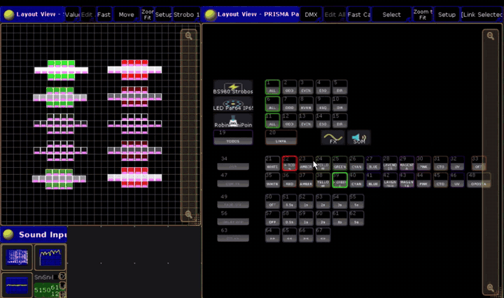 
      <b>COR</b> e <b>COR FX</b> trocando com o efeito de cor rodando
    </td>
    <td align="center" width="50%" valign="top">
      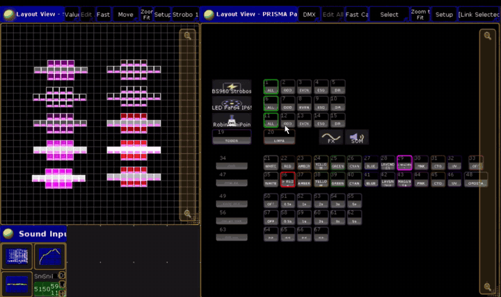 
      <b>COR FX</b> trocando: o efeito muda na hora, sem parar
    </td>
  </tr>
  <tr>
    <td align="center" width="50%" valign="top">
      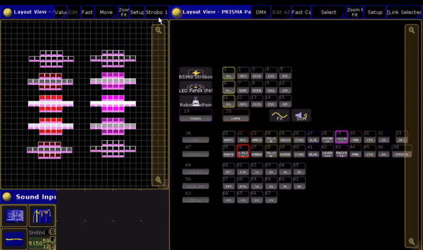 
      A mesma cor nos strobos, nos LEDs e nos movings (três layouts)
    </td>
    <td align="center" width="50%" valign="top">
      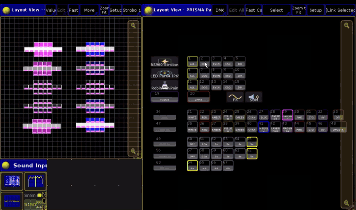 
      <b>ODD</b> e <b>EVEN</b> com <b>FADE 5s</b>, <b>DELAY 5s</b> e <b>DIR &gt;&gt;</b>: a cor escorre pelo palco
    </td>
  </tr>
</table>

---

## 4. Página FX (efeitos sem som)

Efeitos que correm sozinhos, na velocidade do RATE e do BPM, sem ouvir a música.

### Linha FX DIM (efeitos de intensidade)

| Quadrado | O que faz |
|---|---|
| **>>>** | Um pulso corre pela fila, da esquerda para a direita |
| **<<>>** | Espelhado: as duas metades da fila correm juntas, uma o reflexo da outra |
| **1/3** | Uma coluna a cada três acende junto (três grupos se revezando) |
| **2/2** | Um sim, um não: pares e ímpares se revezando |
| **PULSO** | Todos piscam juntos |
| **ONDA** | Onda suave (seno) correndo pela fila |
| **RANDOM** | Acende aleatório |
| **OFF** | Desliga o FX DIM dos grupos marcados |

- **Para que serve:** movimento de luz sem programar cue: perseguição, alternância, respiração.
- **Na mesa:** cada grupo tem um executor de FX DIM (página 99) com uma cue por efeito. O efeito usa o dimmer: **desliga a BATIDA e o NIVEL SOM** do mesmo grupo (os três mexem na intensidade).

### Linha FX COR (efeitos de cor)

| Quadrado | O que faz |
|---|---|
| **COR >>>** | A COR e a COR FX correm pela fila |
| **COR 2/2** | Um aparelho na COR, o próximo na COR FX, e vão trocando |
| **COR ONDA** | Onda suave entre as duas cores, correndo pela fila |
| **OFF** | Desliga o efeito de cor |

- **Para que serve:** duas cores se mexendo no palco, sem mexer na intensidade.
- **Na mesa:** o efeito alterna os presets "PPN COR" e "PPN COR FX". Trocar a COR ou a COR FX muda as cores do efeito sem parar. **Desliga a COR BATIDA** do grupo (os dois mexem na cor).

### Linha MOVE (movimento, só tipos com pan/tilt)

| Quadrado | O que faz |
|---|---|
| **CIRCLE** | Círculo (pan e tilt) correndo pela fila |
| **LEQUE** | Tilt sobe e desce, como um leque abrindo e fechando |
| **ONDA** | Pan balança de um lado para o outro, em onda |
| **SPREAD** | Abre e fecha espelhado a partir do centro |
| **OFF** | Desliga o movimento |

- **Para que serve:** movimento básico dos movings em volta da posição atual.
- **Na mesa:** o movimento é relativo (soma em cima da posição em que o moving está). Grave uma posição antes (ou use a REF FRENTE) para o movimento sair no lugar certo.

### Linha RATE

| Quadrado | O que faz |
|---|---|
| **1/4** · **1/2** · **1x** · **2x** · **4x** | Velocidade dos FX dos grupos marcados (FX DIM, FX COR e MOVE). 1x = normal |
| **BPM** | Pergunta um número e põe os FX nesse BPM (60 = normal, 120 = o dobro) |

- **Para que serve:** acertar o efeito com o andamento da música na mão.
- Para os FX seguirem a música sozinhos, use **MUSICA → AUDIO** na página SOM.

### Página FX em movimento

Efeitos que correm sozinhos, sem ouvir a música. O RATE muda a velocidade sem parar o efeito.

<table>
  <tr>
    <td align="center" width="50%" valign="top">
      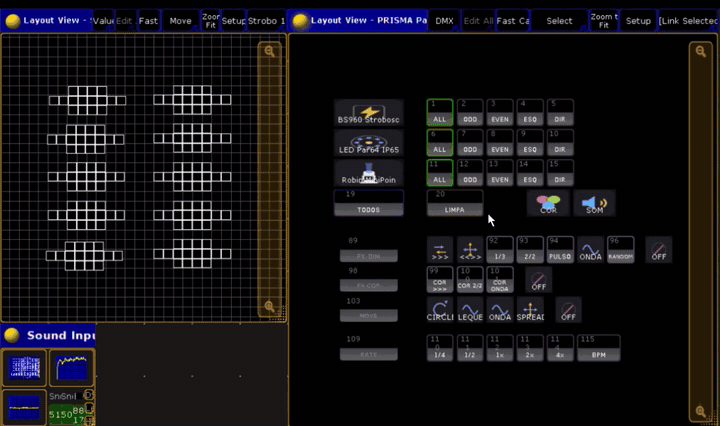 
      <b>FX DIM</b> <code>1/3</code>
    </td>
    <td align="center" width="50%" valign="top">
      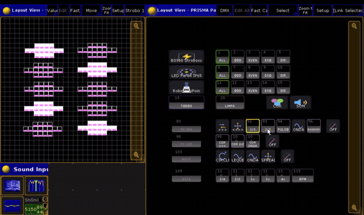 
      <b>FX DIM</b> <code>2/2</code>
    </td>
  </tr>
  <tr>
    <td align="center" width="50%" valign="top">
      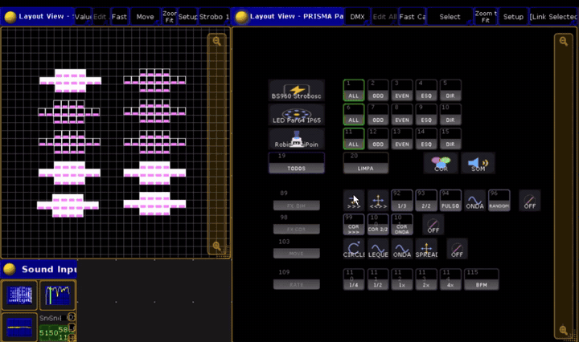 
      <b>FX DIM</b> <code>&gt;&gt;&gt;</code> e os botões <b>OFF</b>
    </td>
    <td align="center" width="50%" valign="top">
      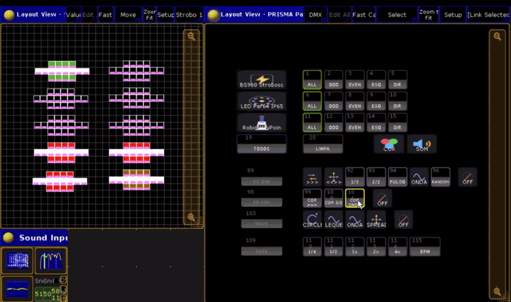 
      <b>FX COR</b>: COR ONDA e COR 2/2
    </td>
  </tr>
  <tr>
    <td align="center" width="50%" valign="top">
      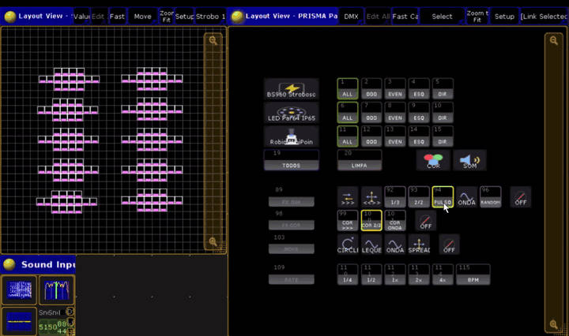 
      <b>PULSO</b> + <b>COR 2/2</b> no RATE 1x
    </td>
    <td align="center" width="50%" valign="top">
      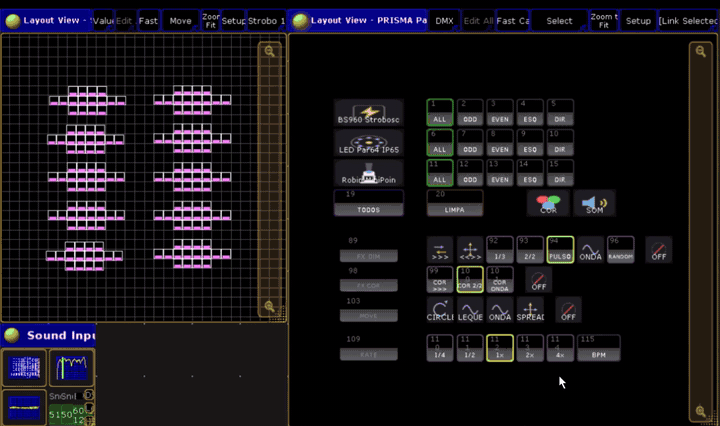 
      <b>RATE 4x</b>: os mesmos efeitos quatro vezes mais rápido
    </td>
  </tr>
  <tr>
    <td align="center" width="50%" valign="top">
      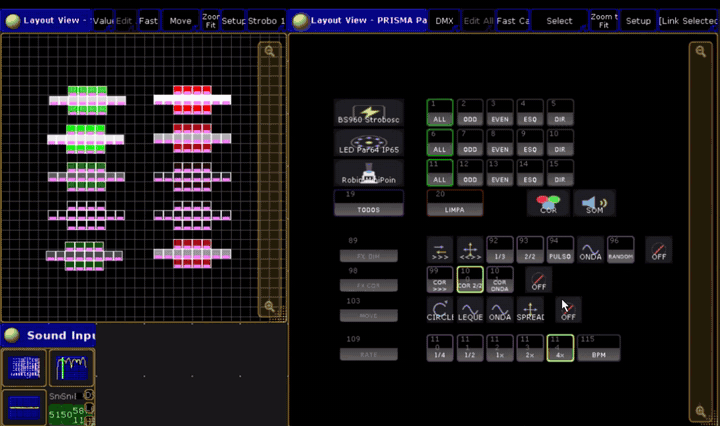 
      <b>RATE 1x</b> com a COR 2/2
    </td>
    <td width="50%"></td>
  </tr>
</table>

---

## 5. Página SOM (efeitos que batem com a música)

Tudo nesta página usa o **Sound Input** da grandMA2 (a entrada de som da mesa ou do PC). Antes de usar, veja a seção [7. Janela Sound Input](#7-janela-sound-input-da-grandma2).

### Linha BATIDA (o desenho anda com a música)

| Quadrado | O que faz |
|---|---|
| **>>>** | Uma coluna acende por batida, da esquerda para a direita |
| **<<<** | Uma coluna por batida, da direita para a esquerda |
| **ONDA** | Corre com rastro: a coluna da batida a 100%, a anterior a 45%, a outra a 15% |
| **<<>>** | Do centro para as pontas, um passo por batida |
| **2/2** | Ímpares e pares se revezando a cada batida |
| **1/3** | Uma coluna em cada três, se revezando a cada batida |
| **RANDOM** | Uma coluna aleatória por batida |
| **FLASH** | Todos acendem numa batida e apagam na seguinte |
| **SINE** | Onda lisa (seno) correndo pela fila sem parar, na velocidade do BPM da música. Não sobe e desce com o volume: só anda |
| **SINE SOM** | A mesma onda do SINE, **correndo sem parar**, que **acende na batida**: sobe a 100% com fade (0.25 s) e volta devagar a 30% (0.9 s) até a próxima batida. A onda anda e sobe e desce com o som, sem tranco. Velocidade pelo RAPIDO, igual ao SINE |
| **RESPIRA** | Todos sobem juntos na batida e descem sozinhos até 15%: a luz "respira" com a música |
| **OFF** | Desliga a BATIDA dos grupos marcados |

- **Para que serve:** a luz andar **no tempo da música**, sem programar chase.
- **Na mesa:** cada grupo tem um executor de BATIDA (página 99, a partir do 99.1). Cada desenho é uma sequence própria; as cues têm trigger **Sound** (a mesa dá o "Go" sozinha quando ouve uma batida). O botão põe a sequence do desenho no executor, começa do 1º passo e sobe o fader no tempo do FADE IN.
- **Desliga o FX DIM e o NIVEL SOM** do mesmo grupo (os três mexem na intensidade).

### Linha SUAVE (transição entre os passos)

| Quadrado | O que faz |
|---|---|
| **SECO** | Troca de passo seca, na batida |
| **0.15s** · **0.3s** · **0.5s** · **1s** | Os passos se misturam com esse tempo (começa em 0.3s) |

- **Para que serve:** batida "picada" (SECO) ou fluida (0.5s, 1s).
- **Na mesa:** muda o fade das cues de todos os desenhos dos grupos marcados. O SINE, o SINE SOM e o RESPIRA têm tempo próprio e não mudam.

### Linha RAPIDO (velocidade da batida)

| Quadrado | O que faz nos desenhos | O que faz no SINE |
|---|---|---|
| **x1** | Um passo a cada batida que a mesa ouve | Metade do BPM da música |
| **x2** | O executor vira um **chaser** no BPM do Sound Input, em dobro | No BPM da música |
| **x4** | Chaser no BPM do Sound Input, quatro vezes | O dobro do BPM |

- **Para que serve:** a mesa costuma pegar só metade das batidas (o 1º e o 3º "tum"). Com **x2** o desenho anda no tempo real da música; com **x4**, no dobro (bom para partes rápidas).
- **Na mesa:** x2/x4 ligam a opção **Chaser** do executor da BATIDA e da COR BATIDA, presos ao Special Master 3.16 "BPM" com Speed Mul2/Mul4. x1 volta ao trigger Sound. Vale para os grupos marcados.

### Linha COR BATIDA (as cores trocam na batida)

| Quadrado | O que faz |
|---|---|
| **TROCA** | Todos trocam entre a COR e a COR FX a cada batida |
| **COR >>>** | A COR FX anda da esquerda para a direita, uma coluna por batida, sobre a COR |
| **COR <<<** | O mesmo, da direita para a esquerda |
| **COR 2/2** | Ímpares e pares trocam de cor a cada batida |
| **OFF** | Desliga a COR BATIDA |

- **Para que serve:** a cor acompanhar a música. Junte com o FX DIM ou com a BATIDA para cor e intensidade mexendo juntas.
- **Na mesa:** executor próprio por grupo, uma sequence por desenho, com as cores dos presets "PPN COR" e "PPN COR FX". **Desliga o FX COR** do grupo. Também segue o RAPIDO.

### Linha NIVEL SOM (a intensidade segue o volume)

| Quadrado | O que faz |
|---|---|
| **TUDO** | O dimmer segue o volume da música inteira |
| **GRAVE** | Segue só o grave (bumbo, baixo) |
| **MEDIO** | Segue os médios (voz, guitarra, caixa) |
| **AGUDO** | Segue os agudos (prato, chimbal) |
| **OFF** | Desliga o NIVEL SOM |

- **Para que serve:** a luz "dançar" com a música: mais forte quando a faixa escolhida está alta, apagada quando está baixa. Todos os aparelhos do grupo juntos.
- **Na mesa:** efeito de dimmer com a forma **Sound** da grandMA2 (SndAll, SndBass, SndMed, SndHigh), no mesmo executor do FX DIM. **Desliga a BATIDA** do grupo. Quer a onda andando e batendo com o som? Use o **SINE SOM** na BATIDA.

### Linha FADE IN (entrada sem flash)

| Quadrado | O que faz |
|---|---|
| **SECO** | O efeito novo entra na hora |
| **0.5s** · **1s** · **2s** | O efeito novo entra com esse fade |

- **Para que serve:** trocar de efeito no meio da música sem "flash".
- **Na mesa:** no NIVEL SOM e no FX DIM, muda o fade da troca de cue. Na BATIDA, o fader do executor desce e sobe nesse tempo quando você escolhe outro desenho.

### Linha MUSICA

| Quadrado | O que faz |
|---|---|
| **AUDIO** | Os FX da página FX (FX DIM, FX COR e MOVE) dos grupos marcados passam a andar no BPM que a mesa tira da música |
| **LIVRE** | Voltam para o RATE de cada um |

- **Para que serve:** efeitos contínuos (onda, círculo, cor correndo) no andamento da música, sem acertar o RATE na mão.
- **Na mesa:** liga os executores de FX ao Special Master 3.16 "BPM". O mesmo vale falando: `fx no ritmo da musica` / `fx no bpm livre`.

### Página SOM em movimento

Tudo aqui anda pelo Sound Input da mesa: o efeito só se mexe quando a música toca.

<table>
  <tr>
    <td align="center" width="50%" valign="top">
      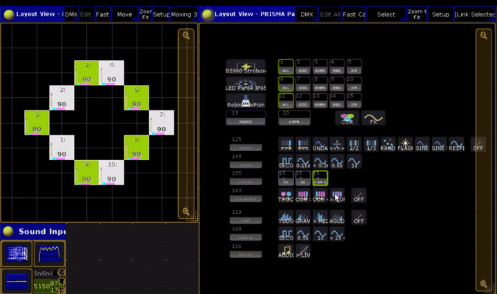 
      <b>BATIDA</b> <code>&gt;&gt;&gt;</code> e <code>&lt;&lt;&lt;</code>: uma coluna por batida (substitui o NIVEL SOM do grupo)
    </td>
    <td align="center" width="50%" valign="top">
      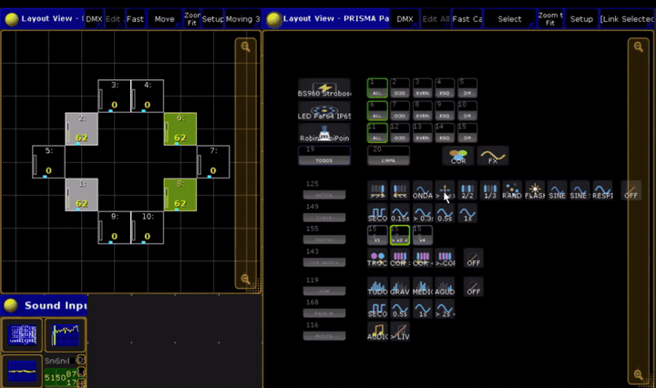 
      <b>BATIDA</b> <code>&lt;&lt;&gt;&gt;</code>: do centro para as pontas
    </td>
  </tr>
  <tr>
    <td align="center" width="50%" valign="top">
      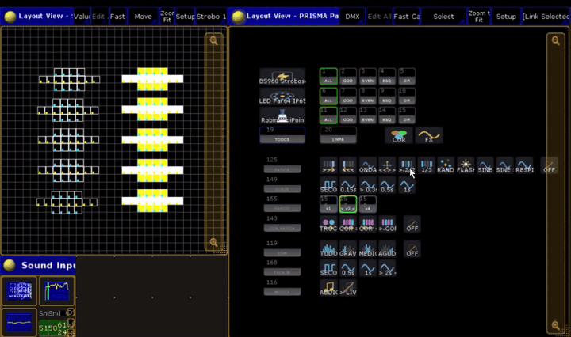 
      <b>BATIDA</b> <code>2/2</code>: de <b>x1</b> para <b>x2</b>
    </td>
    <td align="center" width="50%" valign="top">
      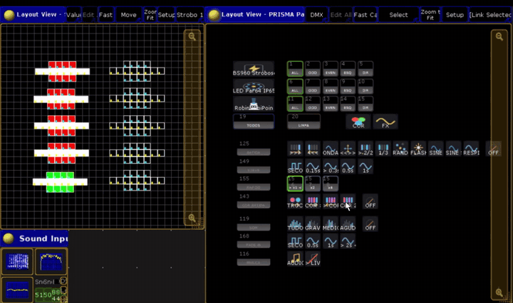 
      <b>BATIDA</b> <code>2/2</code>: <b>x1</b> e <b>x4</b> na mesma música
    </td>
  </tr>
  <tr>
    <td align="center" width="50%" valign="top">
      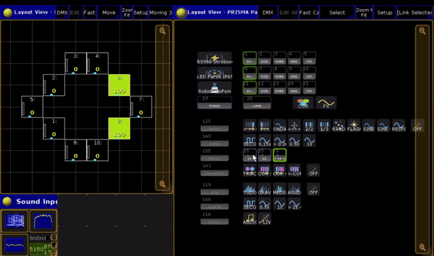 
      <b>RAPIDO x2</b>: o desenho no tempo real da música
    </td>
    <td align="center" width="50%" valign="top">
      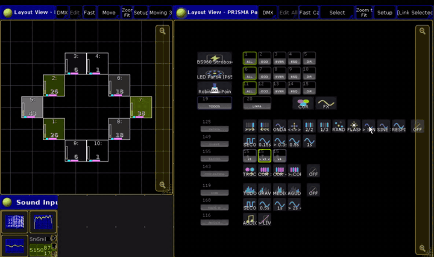 
      <b>SINE</b> correndo, depois <code>1/3</code> e <code>&lt;&lt;&gt;&gt;</code>
    </td>
  </tr>
  <tr>
    <td align="center" width="50%" valign="top">
      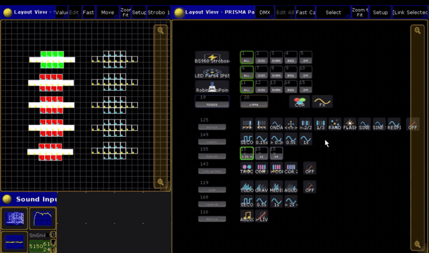 
      <b>FLASH</b>: de x1 para x4
    </td>
    <td align="center" width="50%" valign="top">
      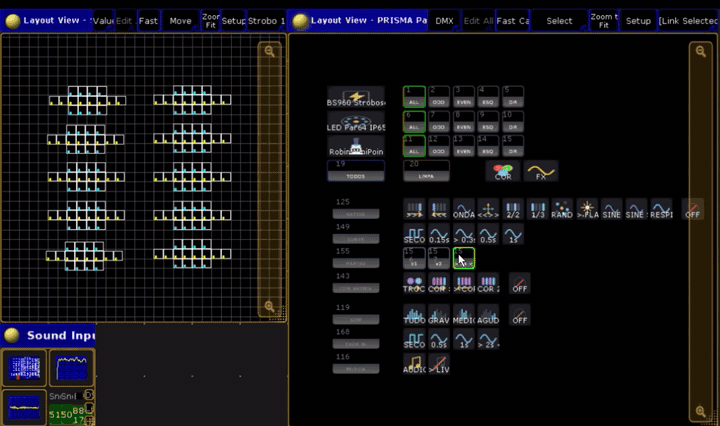 
      <b>RANDOM</b> em x4
    </td>
  </tr>
  <tr>
    <td align="center" width="50%" valign="top">
      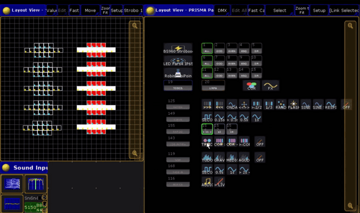 
      <code>2/2</code> + <b>COR BATIDA TROCA</b>: intensidade e cor na batida
    </td>
    <td align="center" width="50%" valign="top">
      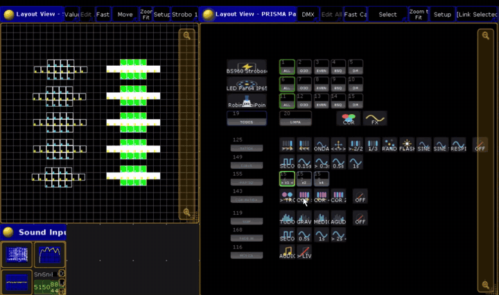 
      <code>2/2</code> + <b>COR BATIDA</b> <code>COR &gt;&gt;&gt;</code> e <code>COR &lt;&lt;&lt;</code>
    </td>
  </tr>
  <tr>
    <td align="center" width="50%" valign="top">
      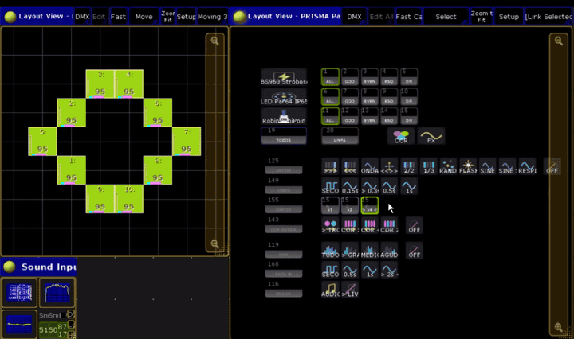 
      <b>COR BATIDA</b>: TROCA, COR &gt;&gt;&gt; e COR &lt;&lt;&lt;
    </td>
    <td align="center" width="50%" valign="top">
      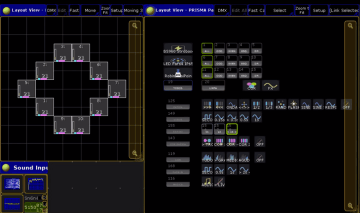 
      <b>NIVEL SOM GRAVE</b>: o dimmer segue o grave, com a COR BATIDA TROCA
    </td>
  </tr>
  <tr>
    <td align="center" width="50%" valign="top">
      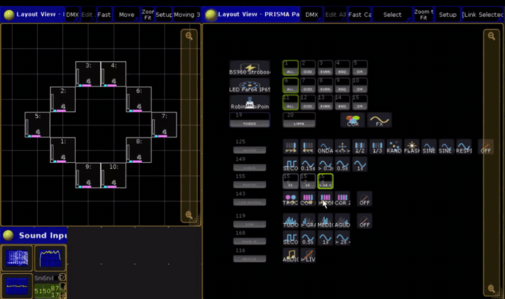 
      <b>NIVEL SOM MEDIO</b> com a COR BATIDA
    </td>
    <td width="50%"></td>
  </tr>
</table>

---

## 6. O que pode rodar junto

Cada grupo tem um executor para cada "camada". Dentro de uma camada, um botão substitui o outro; camadas diferentes rodam juntas.

| Camada | Botões | Roda junto com |
|---|---|---|
| **Cor base** | COR | Tudo |
| **Intensidade** | FX DIM, BATIDA, NIVEL SOM (um de cada vez) | Cor base, efeito de cor, movimento |
| **Efeito de cor** | FX COR ou COR BATIDA (um de cada vez) | Cor base, intensidade, movimento |
| **Movimento** | MOVE | Tudo |

Exemplos que funcionam:

- COR azul + COR FX magenta + **COR BATIDA → TROCA** + **BATIDA → >>>**: cor trocando e luz correndo, tudo na batida.
- COR âmbar + **NIVEL SOM → GRAVE** + **MOVE → CIRCLE**: luz pulsando no bumbo enquanto os movings giram.
- COR branca + **BATIDA → SINE SOM** + **RAPIDO x1**: a onda corre devagar e acende em cada batida.

---

## 7. Janela Sound Input da grandMA2

A página SOM depende de a mesa **ouvir** a música. Na grandMA2 onPC, abra a janela **Sound Input**:

| Controle | O que faz | Valor bom |
|---|---|---|
| **Snd In** (Special Master 2.5) | Ganho da entrada de som | **Baixo**: uns 5 a 15%. Alto demais, todas as faixas ficam no pico e tudo acende junto |
| **Snd Fade** (Special Master 2.6) | Suaviza a resposta ao som | Suba se a luz do NIVEL SOM sobe e desce seco demais |
| **BPM** (Special Master 3.16) | Andamento que a mesa calcula da música | Ela costuma marcar metade do tempo real; por isso o RAPIDO x2 |

- O medidor da janela tem que mexer com a música. Parado: o som não está chegando na mesa (entrada do Windows, volume, cabo).
- `testa o som` (pedido ao PRISMA) faz um diagnóstico do Sound Input para o suporte. Use fora do show: ele mexe por alguns segundos no executor da BATIDA do 1º grupo e depois volta.

---

## 8. O que o painel cria na mesa

| Objeto | Onde | Nome |
|---|---|---|
| Layouts | 3 números livres seguidos | "PRISMA Painel COR", "... FX", "... SOM" |
| Macros | um bloco livre | os botões do painel (+ algumas escondidas, "PPN ...") |
| Executores de cor, FX DIM, FX COR e MOVE | página 99, a partir do 99.101 | "PPN COR ...", "PPN FX DIM ...", "PPN FX COR ...", "PPN MOVE ..." |
| Executores da BATIDA e da COR BATIDA | página 99, a partir do 99.1 | o nome da sequence do desenho que está tocando ("PPN BATIDA <grupo> <nº>") |
| Sequences | um bloco livre | "PPN ..." (uma por executor e uma por desenho da BATIDA / COR BATIDA) |
| Presets de cor | pool 4, bloco livre | "PPN WHITE" ... "PPN UV", "PPN COR", "PPN COR FX" |
| Efeitos-modelo | bloco livre | "PPN COR ..." e "PPN SOM ..." |

- **Nada do seu show é apagado:** o painel usa números livres. Só `refaz o painel` apaga o painel antigo (tudo que é dele, com o nome "PPN" e os layouts "PRISMA Painel").
- A criação usa `ClearAll`: não deixe nada importante no programmer.
- As variáveis do painel ficam salvas no show: reabriu o show, o painel continua funcionando.
- `cria o painel na pagina 5` põe os executores na página 5 em vez da 99.
