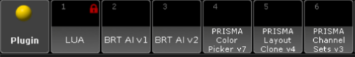
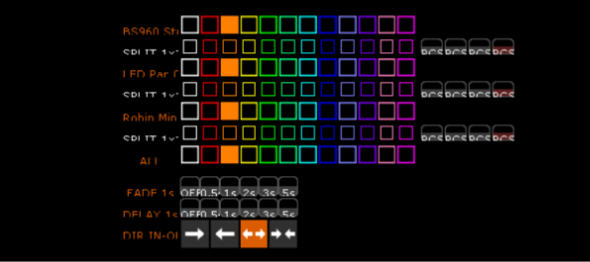
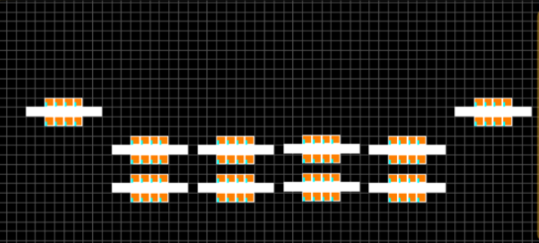

# Plugins na mesa · PRISMA · AI

O PRISMA · AI coloca estes plugins no **pool de Plugins** da grandMA2 onPC. Ele instala sozinho ao clicar em **INICIAR** (também com a mesa em outro PC da rede), e você pode pedir **`instala os plugins`** a qualquer momento: ele coloca só o que faltar, na versão certa.

[← Voltar para o README](../README.md) · [Manual de comandos](MANUAL.md) · [Perguntas frequentes](FAQ.md)



| Nº típico | Plugin | Para que serve | Roda à mão? | A IA usa? |
|---|---|---|---|---|
| 2 | **BRT AI v1** | Pedido direto para a IA | Sim | É a porta de entrada |
| 3 | **BRT AI v2** | Pedido com conversa e aprovação | Sim | É a porta de entrada |
| 4 | **PRISMA Color Picker v8** | Color picker no Layout (uma grade de cores por tipo) | Sim (com perguntas) | Sim (`cria o color picker`, sem perguntas) |
| 5 | **PRISMA Painel v1.5** | O "super color picker": seleção de grupos + cor + FX | Sim | Sim (`cria o painel`, e depois troca cor e FX falando) |
| 6 | **PRISMA Layout Clone v4** | Copiar o desenho de um aparelho de várias células | Sim (com perguntas) | Sim (`clona o desenho do ...`) |
| 7 | **PRISMA Channel Sets v3** | Nomear cores/gobos da roda olhando o aparelho | Sim | Pela tela F6 · Atributos |

Todos os plugins são **ASCII puro** (a MA2 não aceita acento nem emoji dentro do Lua) e **nunca apagam** objetos do show: conferem os números livres antes de gravar.

---

## BRT AI v1 — modo direto

Você pede, a IA decide sozinha e executa. Sem perguntas e sem tela de aprovação.

- "presets nos movings": usa o Group dos movings se existir; senão, todos os aparelhos daquele tipo.
- "paleta de cor": escolhe uma paleta coerente sozinha.

**Como funciona por dentro:** o plugin manda `AI_REQUEST: [AUTO] <pedido>` no feedback da mesa. O `[AUTO]` diz ao programa: não perguntar, não pedir aprovação, executar. O plugin espera o programa escrever `$AI_STATUS = DONE` (ou `ERROR`) e mostra o resultado numa caixa.

**Uso:**

- Direto: rode o plugin e digite o pedido na caixa.
- Por macro: `SetVar $AI_PROMPT = "crie posicoes nos movings"` e depois `Plugin "BRT AI v1"`.

## BRT AI v2 — pergunta, plano e aprovação

Manda o pedido, recebe o plano de comandos, você lê e aprova (ou cancela) antes de qualquer coisa tocar no show.

```
plugin   -> programa : AI_REQUEST: <pedido>
programa -> plugin   : $AI_STATUS = "PLAN"  (e $AI_L1..N com o plano)
plugin   -> programa : AI_APPROVE: <id>
```

Respostas na caixa: `ok` (ou vazio) cria a lista mostrada; `tira a rosa`, `troca o verde por lima`, `acrescenta um lilas` refazem só com a mudança.

Os plugins usam **SetVar** (variável global do show), não SetUserVar: o Telnet do programa entra como Administrator e o plugin roda no perfil da tela; com SetVar os dois se enxergam. Macros antigas com `SetUserVar $AI_PROMPT` continuam funcionando.

---

## PRISMA Painel v1.5 — o "super color picker"

Uma paleta só, e os **grupos viram botões de seleção**: você marca o grupo (ele fica verde) e aperta a cor ou o efeito, que vai só nele. São dois layouts, **COR** e **FX**; o botão `FX >>` / `<< COR` vira a página.

**Antes:** peça `cria os grupos de seleção pelos layouts 1 2 3` (com os números dos seus layouts). **Depois:** `cria o painel` (executores na página 99, longe dos seus playbacks; `cria o painel na pagina 5` escolhe outra).

| Linha | O que faz |
|---|---|
| **Seleção** (uma linha por tipo) | `[TIPO] [ALL] [ODD] [EVEN] [ESQ] [DIR]`: um grupo marcado por tipo. Clicar no nome do tipo marca o ALL. `TODOS` marca o ALL de todos, `LIMPA` desmarca tudo. |
| **COR** | 12 cores + OFF: White, Red, Amber, Yellow, Green, Cyan, Blue, Lavender, Magenta, Pink, CTO, UV. A cor escolhida fica acesa e com `> NOME <`. |
| **COR FX** | A 2ª cor, usada pelos efeitos de cor. **OPOSTA** põe a cor complementar da COR atual (vermelho → verde, âmbar → azul...). |
| **FADE** | OFF, 0.5, 1, 2, 3, 5 s na troca de cor |
| **DELAY** + **DIR** | OFF, 0.5, 1, 2, 3, 5 s · `>>` `<<` `><` (centro sai primeiro) `<>` (pontas saem primeiro) |
| **FX DIM** | `>>>` `<<>>` `1/3` `2/2` `PULSO` `ONDA` `RANDOM` `OFF` |
| **FX COR** | `COR >>>` `COR 2/2` `COR ONDA` `OFF`: alterna a COR e a COR FX. Trocar a cor muda o efeito sem parar ele. |
| **MOVE** | `CIRCLE` `LEQUE` `ONDA` `SPREAD` `OFF` (só tipos com pan/tilt) |
| **RATE** | `1/4` `1/2` `1x` `2x` `4x` e **BPM** (pergunta o número: 60 = normal, 120 = o dobro) |

### Colunas: como o efeito e o delay correm

O efeito e o delay correm **pela ordem do desenho** do layout, da esquerda para a direita:

- Desenho em **andares** (ex.: LED em cima e embaixo, a maioria das colunas com 2 ou mais aparelhos): os aparelhos um em cima do outro formam **uma coluna** e acendem juntos.
- Desenho em **fila**: cada aparelho é uma coluna, mesmo que dois estejam encostados. No `2/2` fica um sim, um não.
- Aparelho de várias células (strobo cluster de 16 quadrados, barra): conta como **um** aparelho, no centro do desenho dele. O strobo inteiro pisca junto.

ODD/EVEN, ESQ/DIR e os grupos do painel seguem as mesmas colunas. Mudou o desenho? Peça os grupos de seleção de novo, apague o painel antigo e crie outro.

### Pela IA

`cria o painel` monta tudo sem perguntas. Com o painel no show, pedidos curtos viram os botões dele, sem gastar a IA:

- `movings vermelho com fade de 2s` · `strobo ímpar magenta` · `par led da esquerda verde` · `grupo 113 âmbar`
- `tudo uv com delay 2s do centro pra fora` · `delay de 1s da esquerda pra direita`
- `beam vermelho e segunda cor oposta` · `cor fx azul nos beams`

O programa marca os grupos (as variáveis do painel) e aperta os botões, e o layout acende igual. Pedidos de efeito e outros mais complexos vão para a IA, que recebe o mapa do painel e usa os mesmos botões.

```
SetVar $PPN_AUTO = "1"
SetVar $PPN_MAP  = "101,102,103,104,105,M,303,1/111,112,113,114,115,D,305,16"
                   (por tipo: ALL,ODD,EVEN,ESQ,DIR ; M = tem pan/tilt ; ícone ; células)
SetVar $PPN_PAGE = "99"
Plugin "PRISMA Painel v1.5"   -> feedback "PPN_OK ..." ou "PPN_ERRO ..."
```

O plugin grava `importexport/ppn_mapa.txt` com o número de cada botão; é ele que deixa a IA usar o painel.

**Atenção:** a criação usa `ClearAll`; não deixe nada importante no programmer. Os botões de DELAY/DIR gravam o delay **às cegas** (BlindEdit) e não mexem no programmer.

---

## PRISMA Color Picker v8

A versão mais simples: uma grade de cores por tipo. Cria um color picker no **Layout View**:

- uma linha por grupo (por padrão, os grupos "… ALL", um por tipo) + uma linha **ALL**, com 12 cores: White, Red, Amber, Yellow, Green, Cyan, Blue, Lavender, Magenta, Pink, CTO e UV;
- um preset de cor por cor (pool 4), feito a partir das gelatinas da mesa (preset global por tipo: RGB, CMY e roda);
- uma sequence por grupo (cada cor é uma cue) num executor;
- macros com feedback visual (quadrado cheio = cor ativa);
- **FADE** (OFF, 0.5, 1, 2, 3, 5 s) para todas as sequences;
- **DELAY** (OFF, 0.5, 1, 2, 3, 5 s) com 4 direções: esquerda→direita, direita→esquerda, centro→fora, fora→centro;
- **SPLIT (2ª cor)** embaixo de cada tipo: `[SPLIT] [12 cores] [1x1] [MET] [PNT] [OFF]`.



### Como a 2ª cor funciona

A cor principal fica no grupo "<tipo> ALL". A 2ª cor vai só no **lado B** do padrão escolhido:

| Botão | Lado B | Grupo usado |
|---|---|---|
| **1x1** | alternado (2º, 4º, 6º...) | `<tipo> EVEN` |
| **MET** | metade da direita | `<tipo> DIR` |
| **PNT** | as pontas | `<tipo> PONTAS` |
| **OFF** | solta o lado B, volta tudo para a cor principal | — |

O lado B fica num executor próprio com **prioridade HIGH**, então trocar a cor principal não apaga a 2ª cor. Esses grupos são criados pelo pedido `cria os grupos de seleção`. Tipo sem esses grupos fica só com a linha normal.

### Pela IA (sem perguntas)

Peça `cria o color picker`. O programa escolhe os grupos "… ALL", manda o mapa da 2ª cor pronto e roda o plugin em modo automático:

```
SetVar $PCP_AUTO = "1"
SetVar $PCP_GROUPS = "101,111,121"     (vazio = grupos ALL)
SetVar $PCP_PAGE = "1"
SetVar $PCP_SPLIT = "101:103,105,107/111:113,115,117"
Plugin "PRISMA Color Picker v8"
```

Resposta no feedback: `PCP_OK layout=N exec=P.E-P.E seq=a-b preset=4.a-4.b macro=a-b image=a-b split=N` ou `PCP_ERRO <motivo>`.

### À mão

Rode **PRISMA Color Picker v8** no pool de Plugins. Ele sugere só os grupos "… ALL" (um por tipo) e o primeiro bloco livre de cada coisa.

**Atenção:** o plugin usa `ClearAll` durante a criação; não deixe nada importante no programmer. Os botões de direção do DELAY gravam os tempos **às cegas** (BlindEdit), só nas cues das sequences do color picker.

**Gelatinas:** cada cor procura a gelatina pelo nome em **todas** as bibliotecas da mesa. CTO e UV não existem na "MA colors": o plugin usa a Lee (Full C.T. Orange, Congo Blue) se ela estiver na mesa; senão, laranja e violeta da MA colors. Feito à mão, ele mostra a lista e pergunta antes.

### Trocar de cor falando

Com o picker no show, pedidos curtos de cor viram os botões do picker, sem gastar a IA: `deixa tudo azul`, `vermelho com fade de 2s`, `âmbar da esquerda pra direita com delay de 1s`. Se o show também tem o **Painel**, o programa usa o Painel.

---

## PRISMA Layout Clone v4

Você arruma **um** aparelho no layout (ex.: o strobo 21, células 21.1 a 21.16, em cruz). O plugin copia esse desenho para os outros aparelhos.



| Modo | O que faz |
|---|---|
| **1 · No lugar, aproximado** (padrão) | Cada aparelho recebe o desenho centrado onde já está e o conjunto é aproximado até sobrar **1 quadrado de folga** entre um desenho e outro, mantendo o arranjo e o centro do grupo |
| **2 · Grade** | O modelo na 1ª casa e os outros ao lado, 5 por linha |
| **3 · No lugar, sem aproximar** | Mantém o espaço que já estava |

Aparelho que ainda não está no layout vai para a grade.

**Pela IA:** `clona o desenho do 21 para 22 a 30 no layout 1` (acrescente `em grade` ou `sem aproximar`; `e salva no layout 5` grava em outro layout).

```
SetVar $PLC_AUTO = "1"         SetVar $PLC_MODEL = "21"
SetVar $PLC_TARGETS = "22 thru 30"   SetVar $PLC_SRC = "1"
SetVar $PLC_DST = "1"          SetVar $PLC_MODE = "1"
Plugin "PRISMA Layout Clone v4"   -> feedback "PLC_OK ..." ou "PLC_ERRO ..."
```

**À mão:** rode o plugin e responda: ID do modelo, IDs que recebem a cópia, layout onde o modelo está, layout para salvar.

**Segurança:** antes de gravar, o layout original é salvo em `importexport/pcl_backup_layout<N>.xml`. Para voltar: `Import "pcl_backup_layout<N>" At Layout <N>`.

---

## PRISMA Channel Sets v3

Dá nome às posições da roda de **cor** ou de **gobo** de um aparelho (os ChannelSets do FixtureType), olhando o aparelho aceso. É o motor da tela **F6 · Atributos**.

1. Pergunta o ID do aparelho (ex.: 201).
2. Pergunta o canal: 1 = Cor, 2 = Gobo, ou o nome do atributo. Se o aparelho tem COLOR1 e COLOR2 (ou GOBO1 e GOBO2), faz os dois.
3. Manda o DMX no canal e pergunta o que apareceu: primeiro de 1 em 1 até medir uma faixa inteira; depois pula de faixa em faixa e pergunta uma vez por faixa.
4. Grava um **FixtureType novo** (modo "<modo> PRISMA") com os nomes. Depois é só trocar o tipo dos aparelhos no Patch.

| Resposta na caixa | Faz |
|---|---|
| nome da cor/gobo (português ou inglês: vermelho = Red, estrela = Star) | dá o nome à faixa |
| Enter (vazio) | igual ao anterior |
| `giro` | começa o giro (devagar→rápido, para, outro lado): o plugin acha sozinho |
| `nome*` | esse nome vai até o fim do canal (ex.: `strobe*`) |
| `fino` | o tamanho das faixas mudou: reaprende dali, de 1 em 1 |
| `volta` | desfaz a última resposta |
| `fim` | grava o que já foi |
| X / Cancelar | cancela tudo, nada é gravado |

**Segurança:** o FixtureType original **não** é alterado. O export original fica em `prisma_cs_backup_<tipo>.xml` e o tipo novo em `prisma_cs_<tipo>.xml`.

---

## Ícones PRISMA (Image pool)

Não é plugin, é um pacote de imagens que o programa importa no **Image pool** (`importa os ícones do prisma`):

- **Aparelhos** (a partir de 301): Moving Spot, Moving Wash, Moving Beam, Spot Perfil, LED Par, Wash Flood, Ripa LED, Strobe, Blinder, Laser, Aparelho genérico.
- **Funções** (a partir de 1200): cores, shutter, prisma, FX.

Usa um bloco livre e reusa o mesmo bloco se o pacote já estiver na mesa; nunca grava por cima de imagens do show. O layout dos tipos (`cria o layout dos tipos com ícones`) e o Painel apontam para esses ícones.

---

## Problemas com plugins

| Sintoma | Solução |
|---|---|
| Aparecem duas cópias do mesmo plugin (ex.: v7 e v8) | Apague a versão antiga do pool. O programa sempre procura a versão do nome (Color Picker v8, Painel v1.5, Layout Clone v4, Channel Sets v3). |
| "O plugin não entrou no Plugin pool" | Peça `instala os plugins`. Se continuar, importe à mão o `.xml` da pasta `lua-plugin` do programa. |
| Pedi o color picker e não veio a 2ª cor | Crie antes os grupos de seleção (`cria os grupos de seleção pelos layouts ...`) e peça o color picker de novo. |
| Efeito ou delay correndo fora de ordem | `reordena os grupos pelo layout N` ou recrie os grupos de seleção pelo layout. |
| No Painel, o `2/2` não alterna um sim, um não | Os grupos foram criados antes da versão 1.0.6 (dois aparelhos encostados viravam uma coluna). Peça os grupos de seleção de novo, apague o painel e crie outro. |
| O Painel não troca de cor quando peço falando | Crie o painel de novo com a versão 1.0.6: é ela que grava o mapa dos botões para a IA. |
| O plugin não respondeu em 2 minutos | Feche caixas abertas na mesa e tente de novo. Com a mesa em rede, confira o Telnet. |

Mais em [Perguntas frequentes](FAQ.md).
